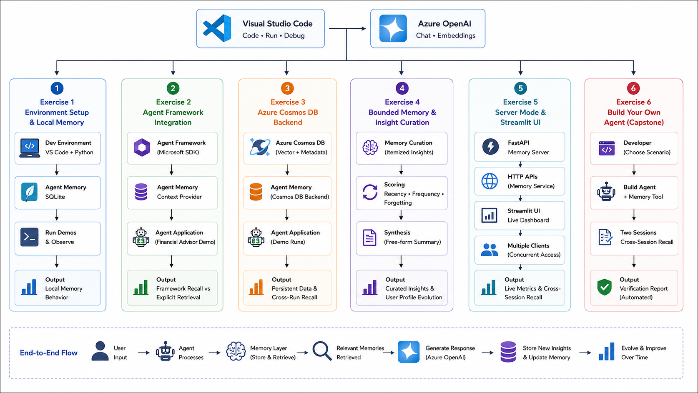
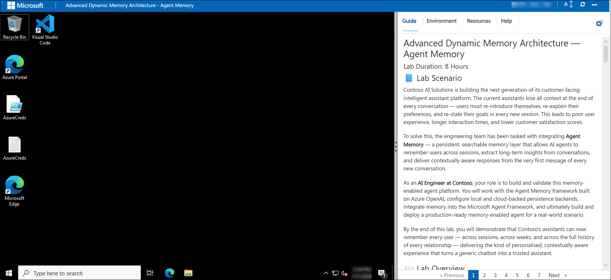
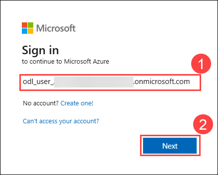

# Advanced Dynamic Memory Architecture — Agent Memory

### Lab Duration: 8 Hours

## 📘 Lab Scenario

Contoso AI Solutions is building the next generation of its customer-facing intelligent assistant platform. The current assistants lose all context at the end of every conversation — users must re-introduce themselves, re-explain their preferences, and re-state their goals in every new session. This leads to poor user experience, longer interaction times, and lower customer satisfaction scores.

To solve this, the engineering team has been tasked with integrating **Agent Memory** — a persistent, searchable memory layer that allows AI agents to remember users across sessions, extract long-term insights from conversations, and deliver contextually aware responses from the very first message of every new conversation.

As an **AI Engineer at Contoso**, your role is to build and validate this memory-enabled agent platform. You will work with the Agent Memory framework built on Azure OpenAI, configure local and cloud-backed persistence backends, integrate memory into the Microsoft Agent Framework, and ultimately build and deploy a production-ready memory-enabled agent for a real-world scenario.

By the end of this lab, you will demonstrate that Contoso's assistants can now remember every user — across sessions, across weeks, and across the full history of every relationship — delivering the kind of personalised, contextually aware experience that turns a generic chatbot into a trusted assistant.

## 📖 Lab Overview

The **Advanced Dynamic Memory Architecture — Agent Memory** workshop is designed to teach developers how to build intelligent agents with persistent, searchable memory across multi-session conversations. Participants will learn to integrate the Agent Memory framework with Azure OpenAI, explore multiple backend persistence options (SQLite, Cosmos DB), and build a production-ready memory-enabled agent application.

The lab begins with environment setup and local memory exploration using a zero-configuration SQLite backend, giving participants a concrete understanding of how `AgentMemory` stores turns, compresses older content into summaries, and recalls facts across sessions. Participants then integrate memory into the Microsoft Agent Framework as a context provider, observing how the system automatically injects prior knowledge into every agent response without any manual retrieval code.

As the lab progresses, participants move from local to cloud-scale persistence by connecting `AgentMemory` to Azure Cosmos DB — verifying that memory survives full application restarts and is accessible from anywhere. They explore advanced curation strategies including bounded itemized memory, which keeps the insight pool compact and relevant by scoring and pruning older facts, and compare it against free-form synthesis that resolves contradictions across sessions.

The final exercises bring everything together — participants expose memory as a live FastAPI service, visualize the system through a real-time Streamlit dashboard, and conclude with a capstone where they build their own memory-enabled agent for a scenario of their choice, proving end-to-end cross-session recall through an automated verification report.

## 🎯 Lab Objectives

This lab is designed to provide participants with hands-on experience in building memory-enabled AI agents using the Agent Memory framework and Azure services. By completing this workshop, participants will learn to:

- **Configure a persistent memory development environment:** Set up the Agent Memory project, configure Azure OpenAI credentials, and verify that the local SQLite backend stores and retrieves conversation turns correctly. Tune key memory parameters including buffer size, active turns, and synthesis frequency to observe how each affects recall behavior.

- **Integrate Agent Memory with Microsoft Agent Framework:** Register `AgentMemory` as a context provider inside a Microsoft Agent Framework agent using `context_providers=[memory]`, observe automatic before-run and after-run memory injection, and contrast framework-managed recall with explicit agent-driven memory tool calls.

- **Deploy cloud-scale persistence with Azure Cosmos DB:** Switch the memory backend from local SQLite to Azure Cosmos DB with a single configuration change, verify that conversation turns, session summaries, and insights persist across separate process runs, and inspect stored JSON documents in the Cosmos DB Data Explorer.

- **Apply advanced memory curation strategies:** Implement bounded itemized memory with a hard insight cap, observe the recency-frequency-forgetting scoring system in action, and compare this against free-form synthesis that explicitly resolves contradictions between sessions into a coherent user profile evolution narrative.

- **Expose memory as a shared HTTP service:** Start the FastAPI memory server, connect multiple clients simultaneously, use the Streamlit visualization dashboard to watch memory metrics update live, and demonstrate backend portability by switching the server from SQLite to Cosmos DB via a single environment variable.

- **Build your own memory-enabled agent:** Create a memory-enabled agent for a chosen scenario, configure an explicit memory retrieval tool, run two conversation sessions to verify cross-session recall, and validate that the agent successfully retrieves and uses previously stored information.

## ⚙️ Prerequisites

Participants should have:
- An active **Microsoft Azure subscription** with access to Azure OpenAI and Azure Cosmos DB resources pre-provisioned in the lab.
- **Python 3.12 or later** installed on the lab VM.
- **Visual Studio Code** with the Python and Jupyter extensions.
- **Basic Python knowledge** working with environment variables, and running scripts from the command line using `uv`.
- **Familiarity with Azure OpenAI** — basic understanding of how Azure OpenAI works and how to navigate the Azure Portal to locate resources and credentials.
- No prior Agent Memory experience required — the lab introduces all framework concepts from scratch.

## 🏗️ Architecture

This architecture demonstrates an end-to-end memory-enabled AI application built using **Azure OpenAI**, **Microsoft Agent Framework**, and **Agent Memory**. The application uses Azure OpenAI to generate responses and embeddings, while Agent Memory manages conversation history, summaries, and semantic recall. During development, memory is stored locally using **SQLite**, and with a simple configuration change, the backend can be switched to **Azure Cosmos DB** for durable, cloud-scale persistence across sessions. The memory service can be exposed through a **FastAPI** server, allowing multiple clients, including the **Streamlit** dashboard, to access and visualize memory in real time. The lab concludes by building a own memory-enabled agent that demonstrates cross-session recall, long-term memory curation, and context-aware responses.

## 🖼️ Architecture Diagram

## 🔍 Explanation of Components

- **Azure OpenAI:** Provides chat completion and embedding models that enable the agent to understand user requests, generate responses, and create vector embeddings for semantic memory search.

- **Agent Framework:** A Microsoft SDK used to build AI agents, orchestrate workflows, and integrate tools and memory into agent applications.

- **Agent Memory:** A memory layer that stores, retrieves, summarizes, and manages conversation history, enabling agents to maintain context across interactions.

- **SQLite:** A lightweight local database used during development to persist conversation history and memory without requiring cloud resources.

- **Azure Cosmos DB:** A cloud-based NoSQL database that provides durable, scalable storage for conversations, summaries, insights, and vector data across sessions.

- **FastAPI Memory Server:** Exposes Agent Memory as an HTTP service, allowing multiple applications and clients to access the same shared memory backend.

- **Streamlit UI:** A web-based dashboard used to visualize conversations, memory updates, and recall behavior in real time.

- **Memory-Enabled Agent:** An AI agent integrated with Agent Memory that retrieves previous conversations, generates context-aware responses, and preserves knowledge across multiple sessions.

# 🚀 Getting Started with Lab

Welcome to the Advanced Dynamic Memory Architecture — Agent Memory Workshop!. Let's begin by making the most of this experience:

## Accessing Your Lab Environment

Once you are ready to dive in, your virtual machine and guide will be right at your fingertips within your web browser.
 

## Lab Guide Zoom In/Zoom Out

To adjust the zoom level for the environment page, click the **A↕ : 100%** icon located next to the timer in the lab environment.

## Virtual Machine & Guide
 
Your virtual machine is your workhorse throughout the workshop. The guide is your roadmap to success.
 
## Exploring Your Lab Resources
 
To get a better understanding of your lab resources and credentials, navigate to the **Environment** tab.
 

 
## Utilizing the Split Window Feature
 
For convenience, you can open the guide in a separate window by selecting the **Split Window** button from the top right corner.
 

 
## Managing Your Virtual Machine
 
Feel free to **start, stop, or restart (2)** your virtual machine as needed from the **Resources (1)** tab. Your experience is in your hands!
 
	

## Let's Get Started with Azure Portal
 
1. On your virtual machine, click on the Azure Portal icon as shown below:
 
    
 
2. You'll see the **Sign into Microsoft Azure** tab. Here, enter your credentials **(1)** and click **Next (2)**.
 
   - **Email/Username:** <inject key="azureUserName"></inject>
 
    
 
3. Next, provide your temporary password **(1)** and select **Sign in (2)**.
 
   - **Temporary Access Pass:** <inject key="AzureAdUserPassword"></inject>
 
      
 
4. If prompted to stay signed in, you can click **No**.

   
 
   
Now you're all set to explore the powerful world of technology. Feel free to reach out if you have any questions along the way. Enjoy your workshop!

## 📞  Support Contact

The CloudLabs support team is available 24/7, 365 days a year, via email and live chat to ensure seamless assistance at any time. We offer dedicated support channels tailored specifically for both learners and instructors, ensuring that all your needs are promptly and efficiently addressed.

Learner Support Contacts:

* Email Support: cloudlabs-support@spektrasystems.com 
* Live Chat Support: https://cloudlabs.ai/labs-support

Now, click on Next from the lower right corner to move on to the next page.

   

### Happy Learning!!

