# Exercise 1: Environment Setup & Local Memory

### Estimated Duration: 75 Minutes

## 📘 Scenario

Contoso Health Services is developing AI-powered applications that can retain conversation history and provide more contextual responses to users. To enable this capability, the development team is using the **Agent Memory** framework, which provides persistent memory, conversation summarization, and semantic retrieval for AI agents.

In this exercise, you will prepare the local development environment, configure the application to connect with the pre-provisioned Azure OpenAI resource, and execute the **Basic Agent Memory** notebook. The notebook uses **SQLite as a local memory store**, allowing you to observe how conversations are stored, summarized, and retrieved across multiple sessions without requiring any additional database infrastructure.

## 📖 Overview

Before building intelligent AI applications, it is important to understand how conversational memory works and why it is required. Instead of treating every interaction as an isolated request, Agent Memory enables applications to retain important information from previous conversations, making responses more relevant and context-aware.

In this exercise, you will verify the required development tools, configure the Azure OpenAI connection, install the project dependencies, and execute the **01_basic_memory.ipynb** notebook. Throughout the notebook, you will explore how Agent Memory stores conversations in a **SQLite local database**, automatically summarizes older interactions, retrieves previous context across sessions, and performs semantic search using vector embeddings.

## 🎯 Objectives

In this exercise, you will perform:

- Task 1: Verify Tools and Open the Project
- Task 2: Review Environment Configuration
- Task 3: Install Dependencies & Run Basic Demo
- Task 4: Observe Memory Behavior
- Task 5: Explore Memory Configuration Tuning (Optional)

## Task 1: Verify Tools and Open the Project

In this task, you will verify that the required development tools are available, open the Agent Memory project in Visual Studio Code, and become familiar with the repository structure before running the notebook.

1. On the **Desktop** of your **Lab VM**, launch **Visual Studio Code**.

   

1. Once the IDE opens, if you see the ***Welcome to VS Code*** sign-in pop-up for GitHub, simply close the window by clicking the **X** in the upper-right corner.

   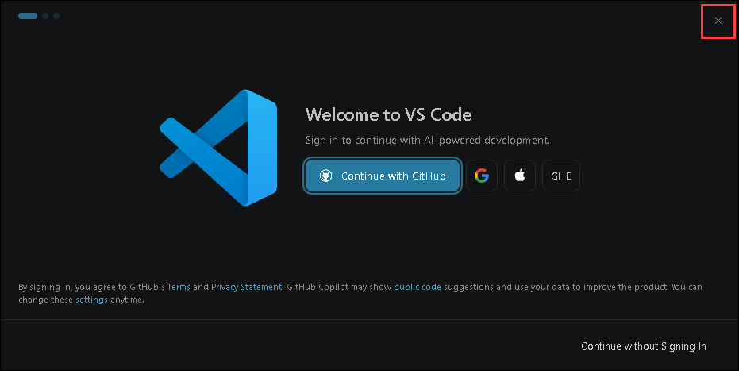

1. Go to **File (1)** and click **Open Folder... (2)**.

   

1. Navigate to `C:\LabFiles` **(1)**, select the **agent-memory (2)** folder and then click **Select Folder (3)**.

   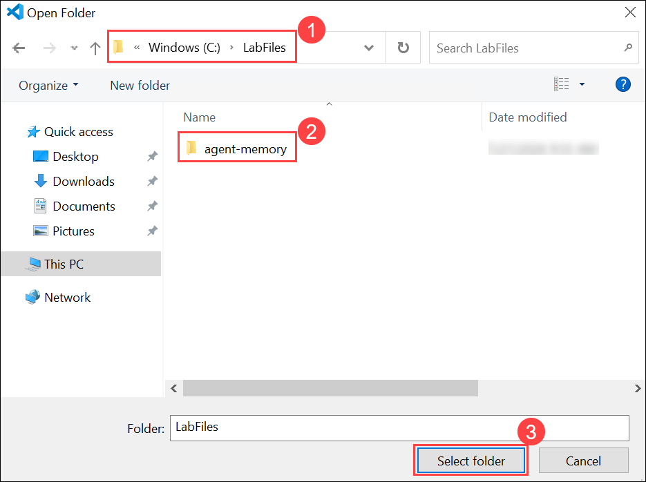

1. If there is a notification that it is in **Restricted mode**, click on **Manage**. 

   

1. You will see a **Workspace Trust** wizard click on **Trust (1)** and close the wizard by clicking on **X (2)**.

   

1. In the Explorer pane, confirm the following top-level folders are present: **notebooks/**, **demo/**, **memory/**, **server/**, **tests/**.

   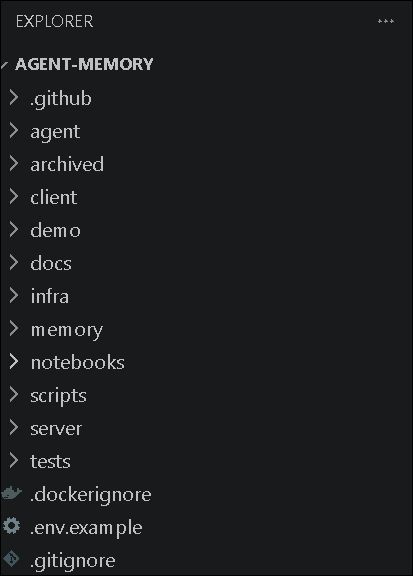

   Each folder serves a specific purpose within the project:

   - **notebooks/** contains sample notebooks and demonstrations used throughout the lab.
   - **demo/** contains sample python scripts and demonstrations used throughout the lab.
   - **memory/** contains the core Agent Memory implementation.
   - **server/** includes components used when exposing Agent Memory as a service.
   - **tests/** contains automated tests that validate the functionality of the project.

1. Click on the **ellipsis (...) (1)** in the top menu, then select **Terminal (2)** and click **New Terminal (3)**.

   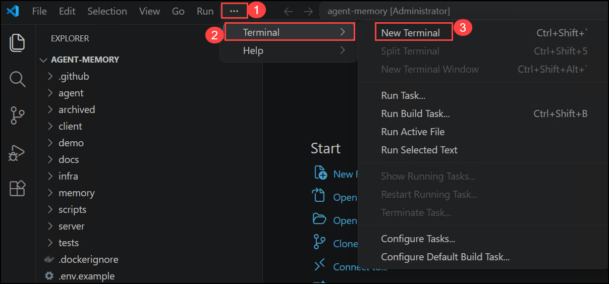

1. Verify the required tooling versions by running the following commands one by one:

   ```
   python --version
   uv --version
   git --version
   ```

   

   > **Note:** Python **3.12 or later** is required for this lab because the SQLite vector extension (`sqlite-vec`) used by the local memory implementation depends on newer Python versions.

## Task 2: Review Environment Configuration

In this task, you will navigate to the pre-created Azure OpenAI resource, open it in the Azure portal, copy the endpoint and API key, and paste them into the project's `.env` file.

> **Note:** The Azure OpenAI resource and its model deployments have already been created in this lab environment — you do not need to create any new resources.

1. On the **Microsoft Edge** browser, go to **Azure portal**. In the search bar at the top, search for **Azure OpenAI (1)**, and select **Azure OpenAI (2)** from the **Services** section.

   

1. Select the **openai-<inject key="Deployment ID" enableCopy="false"></inject>**

   

1. From the left navigation pane, expand **Resource Management** and then select **Keys and Endpoint (1)**. 

1. Copy the **Endpoint (2)** and paste it into Notepad for later use.

1. Copy the **KEY 1 (3)** and paste it into Notepad for later use.

   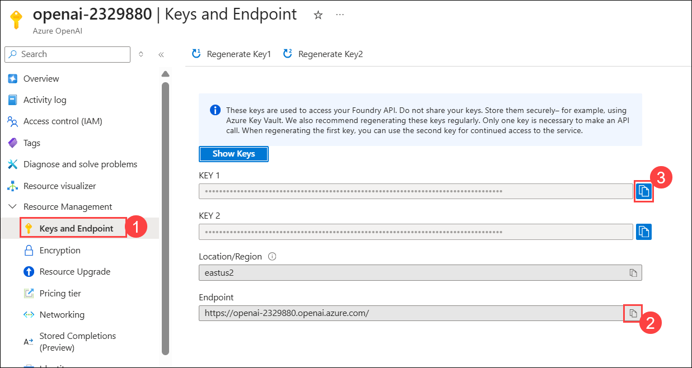

1. Return to Visual Studio Code. In the Explorer pane, select and right click on `.env.example` **(1)** and select **Rename (2)**.

   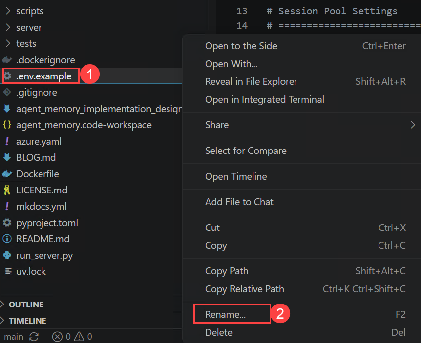

1. Rename the file to `.env` and click on it to open the file.

   

1. In the `.env` file, provide the following environment variables using the values you copied to Notepad:

   - **AZURE_OPENAI_ENDPOINT**: Repalce the endpoint value you copied in Step 4.
   - **AZURE_OPENAI_API_KEY**: Replace the API key you copied in Step 5.

   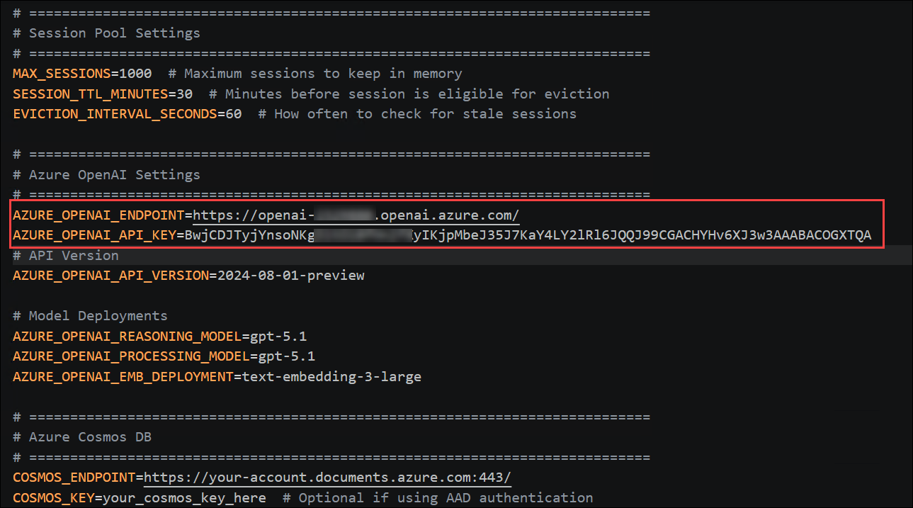

1. Save the changes made to the `.env` file by pressing **CTRL + S**.

## Task 3: Install Dependencies & Run Basic Demo

In this task, you will install the project dependencies, open the `01_basic_memory.ipynb` notebook, select the Python kernel, and execute the setup, initialization, and Session 1 cells to understand how Agent Memory stores conversations, manages the memory buffer, and prepares data for long-term recall.

1. In the Visual Studio Code **terminal**, run the below command from the project root to install all dependencies:

   ```
   uv sync --extra dev
   ```

   

   > **Note:** This can take 10–15 minutes to complete. Wait for the command execution to complete, then proceed ahead.

1. In the Explorer pane, navigate to the  **notebooks (1)** folder and open the **01_basic_memory.ipynb (2)** file.

   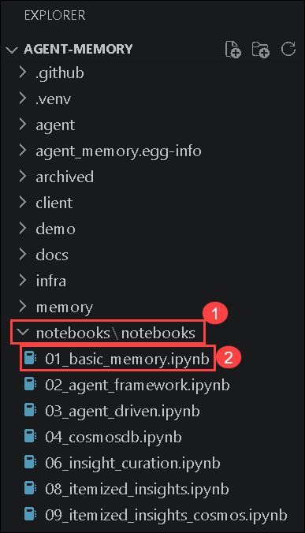

1. Read the **01 Basic Agent Memory Demo** markdown cell to understand the key Agent Memory capabilities demonstrated in this notebook, including conversation storage, active memory management, automatic summarization, cross-session recall, and semantic search using **SQLite** as the local memory backend.

      

1. Click **Select Kernel (1)** in the top-right corner and choose **Install/Enable suggested extensions Python + Jupyter (2)** if prompted.

   

1. Wait for the Python and Jupyter extensions to be installed.

   > **Note:** This can take 5–10 minutes to complete. Wait for the installation to complete, then proceed ahead.

1. Once the Python extension is installed, click on **Select Kernel (1)** then select **Python Environments (2)** 

   

1. Select the project's virtual environment, **agent-memory(3.12.X)(Python 3.12.X)** from the list to ensure that the Jupyter Notebook runs in the correct Python interpreter with the necessary dependencies installed.

   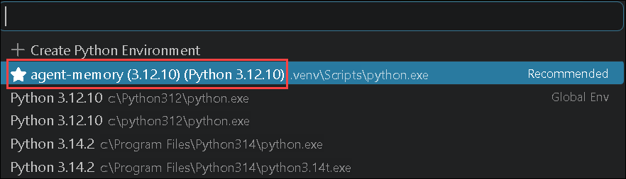

1. Scroll down to **Step 1: Setup and Configuration** and click **Run (▶)** to execute the first code cell. This cell prepares the notebook environment before running the Agent Memory demonstrations by importing the required libraries, locating the project directory, loading the Azure OpenAI configuration from the **.env** file, configuring the demo settings, and creating a fresh **SQLite** database for the exercise.

   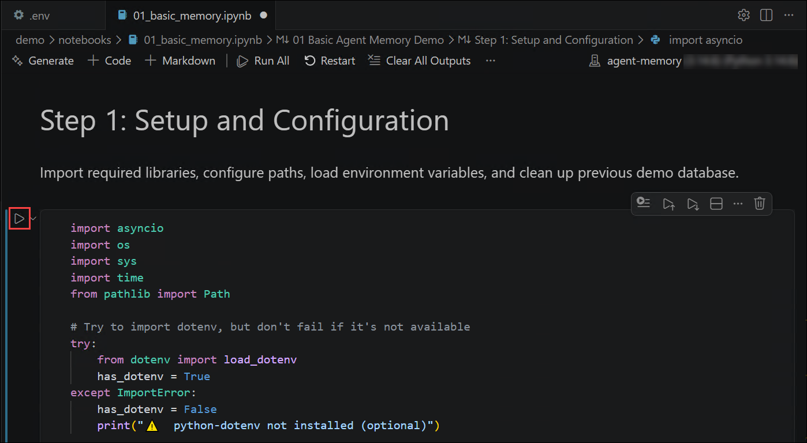

1. After the cell executes successfully, verify that the output confirms the project paths and environment configuration, and displays the message **"✅ Step 1 Complete: All imports and paths configured!"**, as shown in the following image.

      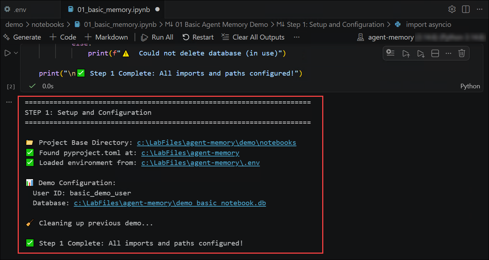

1. Scroll down to **Step 2: Initialize AgentMemory with Buffer Configuration** and click **Run (▶)** to execute the code cell. This cell initializes the **Azure OpenAI** client, validates the required environment variables, creates the **Agent Memory** configuration, initializes the local **SQLite** memory database, and connects Agent Memory with Azure OpenAI.

   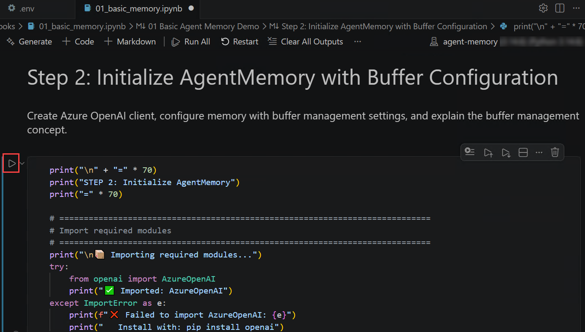

1. After the cell executes successfully, verify that the output confirms the Azure OpenAI client and Agent Memory were initialized successfully, and displays the message **"✅ AgentMemory initialized and ready!"**, as shown in the following image.

   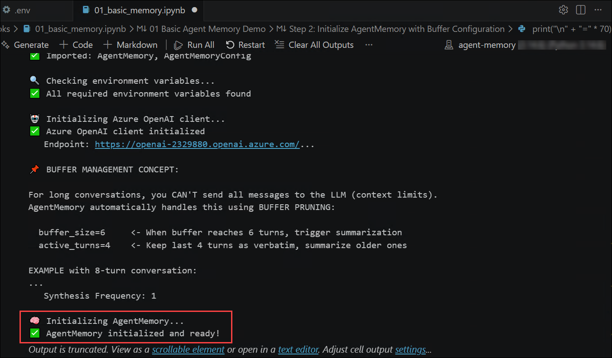

   > **Important:**  Agent Memory uses a configurable conversation buffer to efficiently manage long-running conversations.
   > - **buffer_size** specifies the maximum number of conversation turns before automatic summarization begins.
   > - **active_turns** determines how many of the most recent conversation turns remain available in their original form.
   > - **longterm_synthesis_frequency** controls how often long-term insights are generated from completed conversations.
   > As conversations grow, older interactions are automatically summarized while recent messages remain available. This helps preserve important context without exceeding the model's context window.

1. Scroll down to **Step 3: Session 1 – Multi-Turn Conversation with Buffer Pruning** and click **Run (▶)** to execute the code cell. This cell starts a new conversation session and processes a predefined **eight-turn conversation**. During execution, Agent Memory stores each user and assistant interaction, monitors the configured memory buffer, automatically summarizes older conversation turns when the buffer limit is reached, and generates long-term insights for future retrieval.

   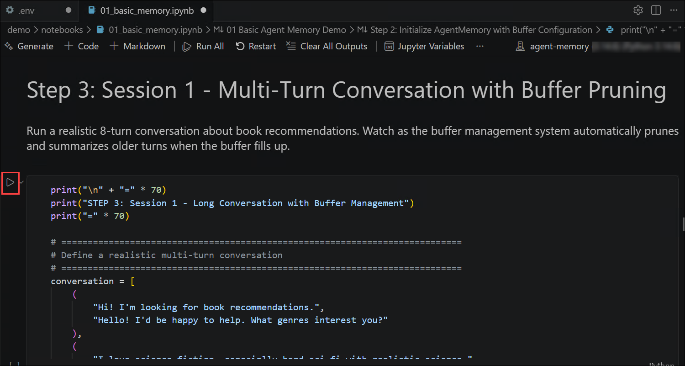

   > **Note:** The sessions are pre-scripted so the demo runs without user input and completes in under two minutes. You are observing what the system *does* with those conversations, not having a live chat.

1. After the cell executes successfully, verify that the output shows the conversation session has started, the buffer configuration has been applied, and the conversation turns are being processed, as shown in the following image.

   

   > **Important:** Agent Memory continuously monitors the configured **buffer_size** as the conversation grows. When the buffer reaches its limit, older conversation turns are automatically summarized while the most recent turns remain available in their original form. This allows the application to preserve important context without exceeding the model's context window.

   > **Note:** To view the complete output, scroll to the bottom of the cell output and click **scrollable element**, as shown in the following image.

   

## Task 4: Observe Memory Behavior

In this task, you will observe how Agent Memory retrieves information from previous sessions and uses semantic search to find relevant conversations. These capabilities help AI agents maintain context and deliver more relevant responses over time.

1. Scroll down to **Step 4: Cross-Session Memory Recall** and click **Run (▶)** to execute the code cell. This cell starts a new session and automatically retrieves the conversation summaries and long-term insights generated during **Session 1**, demonstrating cross-session memory recall.

   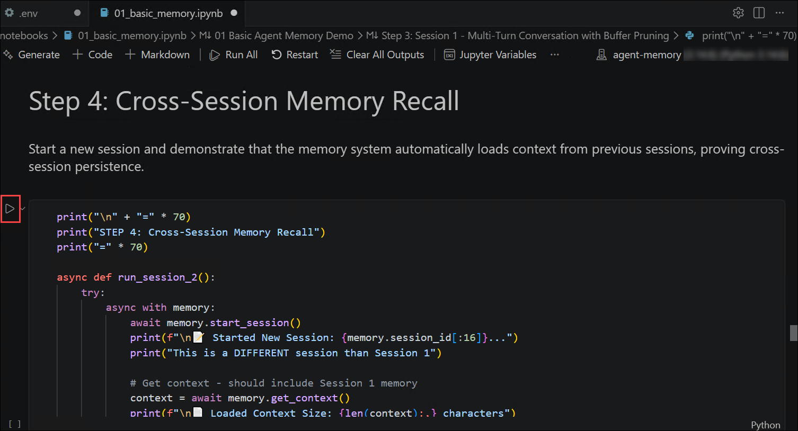

1. After the cell executes successfully, verify that the previous conversation context is loaded and the message **"✅ Cross-Session Memory Loaded!"** is displayed, as shown in the following image.

   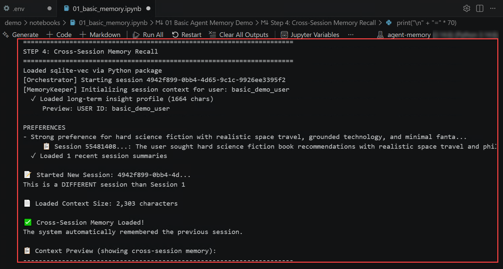

1. Scroll down to **Step 5: Semantic Search Demonstration** and click **Run (▶)** to execute the code cell. This cell performs semantic searches across the stored conversations by comparing the meaning of each query with previously stored memories, demonstrating how Agent Memory retrieves relevant information beyond exact keyword matches.

   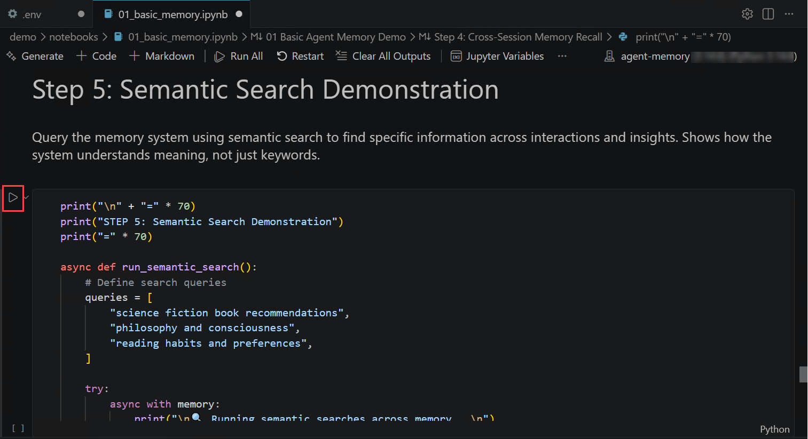

1. After the cell executes successfully, verify that the semantic search results are returned for each query and that the notebook ends with the message **"🎉 NOTEBOOK COMPLETE!"**, as shown in the following image.

   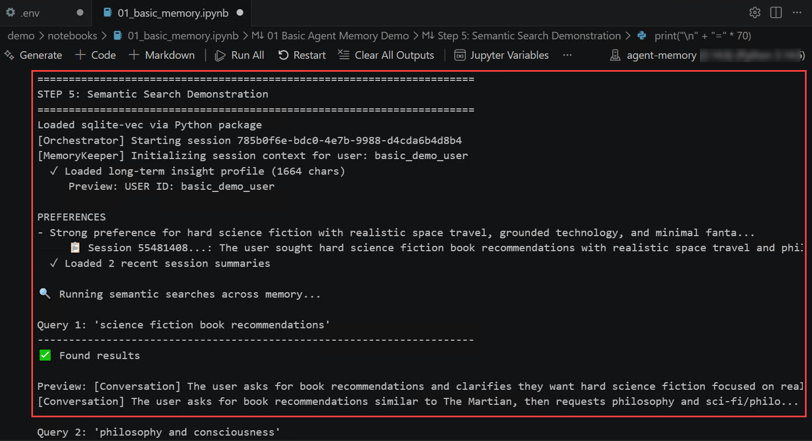

## Task 5: Explore Memory Configuration Tuning (Optional)

In this task, you will adjust the key memory configuration parameters in the notebook and re-run it to observe how behavior changes with different settings.

1. In the notebook, scroll to the **Step 2: Initialize AgentMemory** code cell and locate the **AgentMemoryConfig** block:

   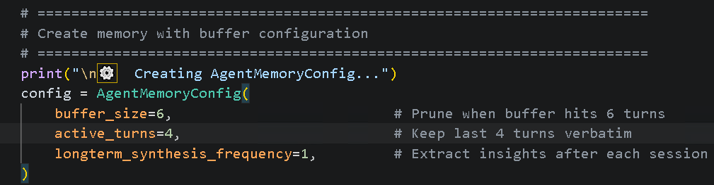

1. Change **buffer_size** to a lower value, such as `3`, and **active_turns** to `2`.

   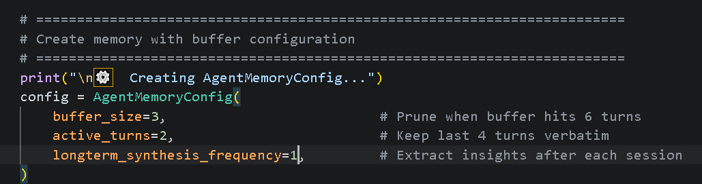

1. Restart the kernel by clicking **Restart (1)** in the notebook toolbar and then **Run all (2)** to execute all the cells from the top

   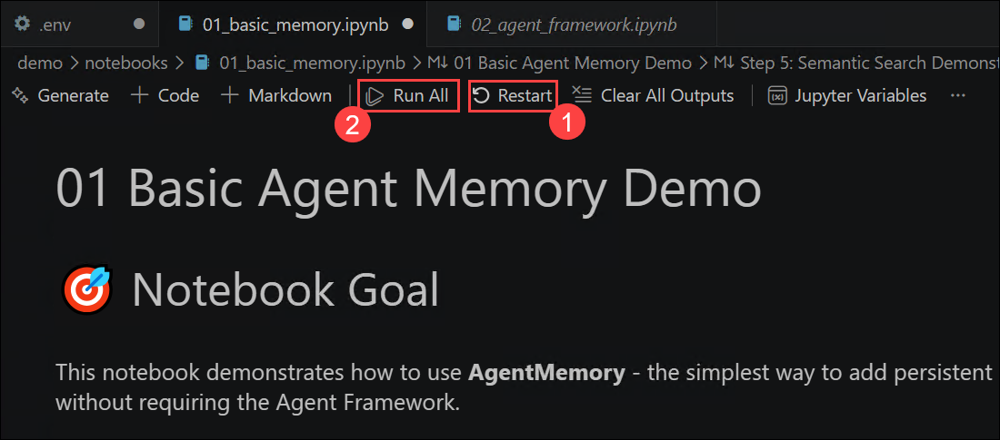

   > **Note:** Restarting is required — the memory object and configuration are created at cell execution time, so edits do not take effect on an already-running kernel state.

1. Observe in the **Step 3** output how **summarization triggers earlier** than in the previous run — the buffer now fills after only 3 turns, so pruning happens much sooner in the 8-turn conversation, and only the last 2 turns remain verbatim.

   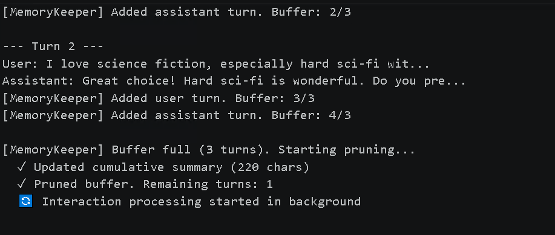

   > **Note:** The remaining turns after pruning may not always exactly match the configured **`active_turns`** value. This is expected behavior based on Agent Memory's internal buffer management.

1. Next, change **`longterm_synthesis_frequency`** to **`2`** and re-run the notebook. Notice that no long-term synthesis is generated after **Session 1**, as insights are created only after every **two completed sessions**.

   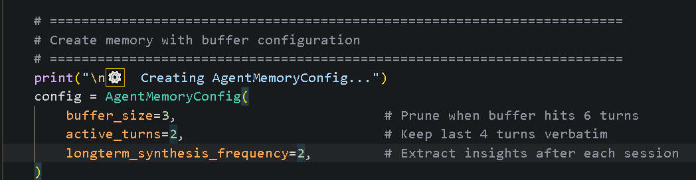
      
   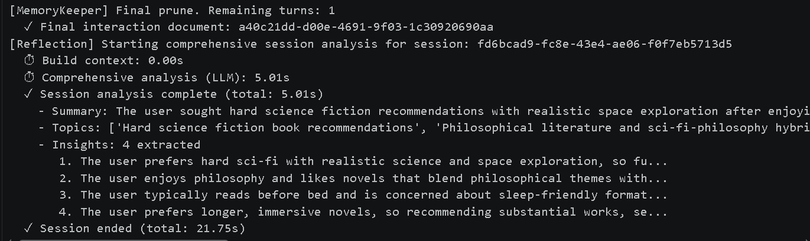

1. After observing the differences, revert all values to their defaults (`buffer_size=6`, `active_turns=4`, `longterm_synthesis_frequency=1`) and save it by clicking on **CTRL + S**

   

## 🧾 Summary

In this exercise, you prepared the local development environment and explored the core capabilities of the Agent Memory framework using a **SQLite** local memory store. You verified the required tools, configured the project to use the pre-provisioned Azure OpenAI resource, installed the project dependencies, and successfully executed the **01_basic_memory.ipynb** notebook in Visual Studio Code. You also observed how Agent Memory stores conversations, manages the active memory buffer, retrieves information across multiple sessions, and performs semantic search using vector embeddings. Finally, you experimented with key memory configuration settings to understand how they affect conversation summarization and long-term insight generation.

You have successfully completed this exercise. Select **Next >>** to continue to the next exercise.

   
