# Exercise 2: Agent Framework Integration

### Estimated Duration: 90 Minutes

## 📘 Scenario

In the previous exercise, you used the repository's direct memory flow to observe how conversation state, summaries, and recall behave with a local backend. Contoso Health Services now wants its AI agents to manage memory automatically as part of the agent lifecycle, rather than through manual calls.

In this exercise, you will act as an AI Engineer responsible for studying how **AgentMemory** integrates with the **Microsoft Agent Framework**, running the financial advisor scenario to verify cross-session recall, comparing framework-managed memory with an agent-driven retrieval pattern, and analyzing how repeated sessions are curated into durable long-term insights.

## 📖 Overview

In this exercise, you will review the Microsoft Agent Framework integration pattern used by the repository, run multiple notebooks from the preloaded project, and compare two different approaches to memory retrieval:

- Framework-managed context injection with `context_providers=[memory]`
- Agent-driven retrieval, where the agent explicitly calls memory tools when it decides a lookup is needed
- Insight curation that turns repeated sessions into durable, evolving profile knowledge

You will work entirely from the prepared lab VM and the repository that was staged during deployment.

## 🎯 Objectives

In this exercise, you will perform:

- Task 1: Study the Integration Pattern
- Task 2: Run the Financial Advisor Demo
- Task 3: Compare Agent-Driven Memory Retrieval
- Task 4: Long-Term Insight Extraction

## Task 1: Study the Integration Pattern

In this task, you will open the Agent Framework notebook and inspect how `AgentMemory` is registered as a context provider inside the Agent Framework, identifying the lifecycle hooks that make memory automatic.

1. In the Explorer pane, navigate to the  **notebooks (1)** folder and open the **02_agent_framework.ipynb (2)** notebook.

   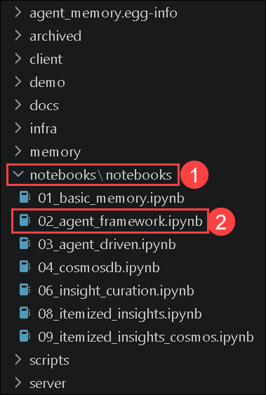

1. Take a moment to read the first markdown cell, **"Agent Framework + AgentMemory Integration"**.

   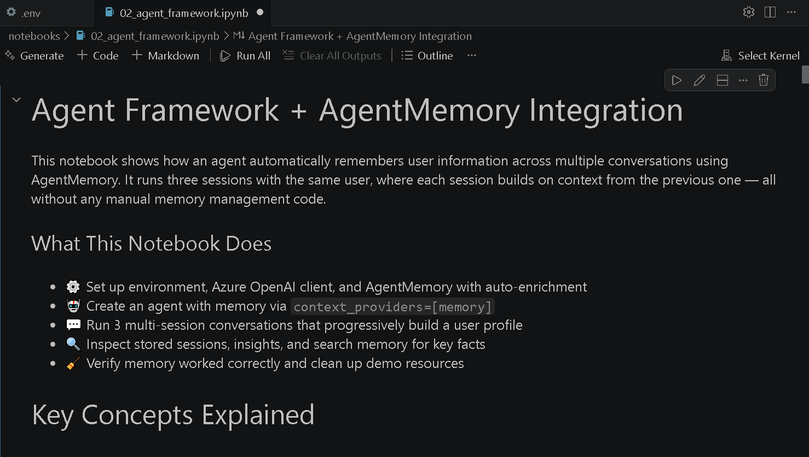

   >**Important:** It introduces the three key concepts demonstrated in this exercise.
   > - **ContextProvider pattern** — Agent Memory is passed to the agent through `context_providers=[memory]`, eliminating the need to manually manage conversation history.
   > - **Automatic context injection** — `memory.before_run()` is invoked automatically before each agent response to load previous conversation context and the user's long-term profile.
   > - **Automatic turn capture** — `memory.after_run()` is invoked automatically after each response to store the latest conversation turn in memory.

1. Scroll to the first code cell (**Steps 1–6: Setup, Configuration & Agent Initialization**) and review the code without executing it.

   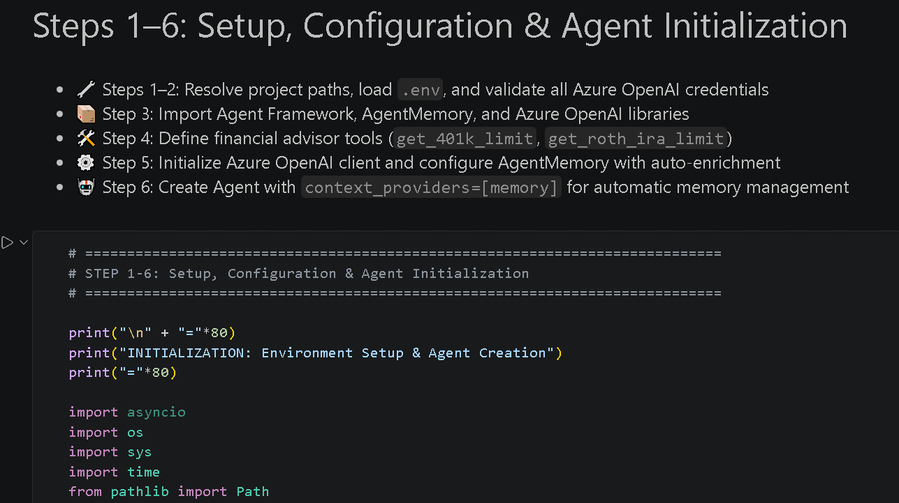

1. The **environment validation** section, which verifies the required Azure OpenAI configuration values: `AZURE_OPENAI_ENDPOINT`, `AZURE_OPENAI_API_KEY`, `AZURE_OPENAI_REASONING_MODEL`, and `AZURE_OPENAI_EMB_DEPLOYMENT`.

   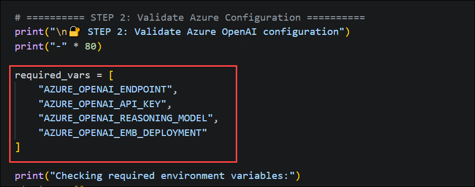

1. The **AgentMemoryConfig** section. Notice that `auto_enrich_context=True` enables automatic context injection, while `enrichment_trigger_keywords` contains keywords such as **remember**, **previous**, and **last time** that indicate the user is referring to earlier conversations.

   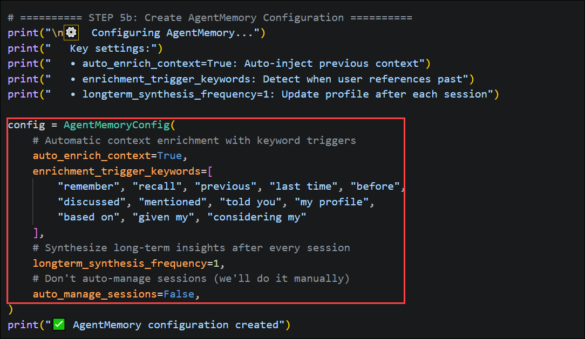

1. The **Agent** initialization section. Notice that **Agent Memory** is integrated with the agent as a **context provider**, enabling automatic retrieval of previous conversation context before each response and automatic storage of new conversation turns after each interaction.

   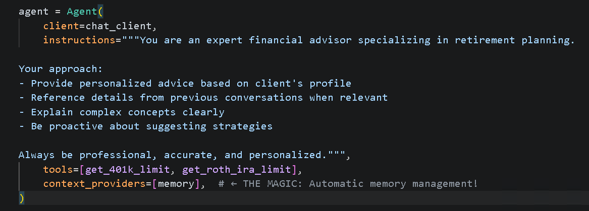

1. Press **CTRL + F**, search for **`add_turn`**, and verify that there are no matches inside the notebook cells, confirming that conversation turns are automatically stored by the Agent Framework instead of using manual memory API calls.

1. **Direct Agent Memory** vs **Agent Framework Integration**

| Direct Agent Memory | Agent Framework Integration |
|---------------------|-----------------------------|
| Manual `add_turn()` | Automatic `after_run()` |
| Manual `get_context()` | Automatic `before_run()` |
| Direct AgentMemory APIs | ContextProvider pattern |
| Manual memory lifecycle | Automatic memory lifecycle |

## Task 2: Run the Financial Advisor Demo

In this task, you will run the Agent Framework notebook and observe how Agent Memory automatically retrieves previous conversation context and stores new interactions across multiple sessions, without requiring any manual memory operations in the application code.

1. In the **02_agent_framework.ipynb** notebook, click **Select Kernel (1)** in the top-right corner and choose **agent-memory(3.12.X)(Python 3.12.X) (2)** if prompted.

   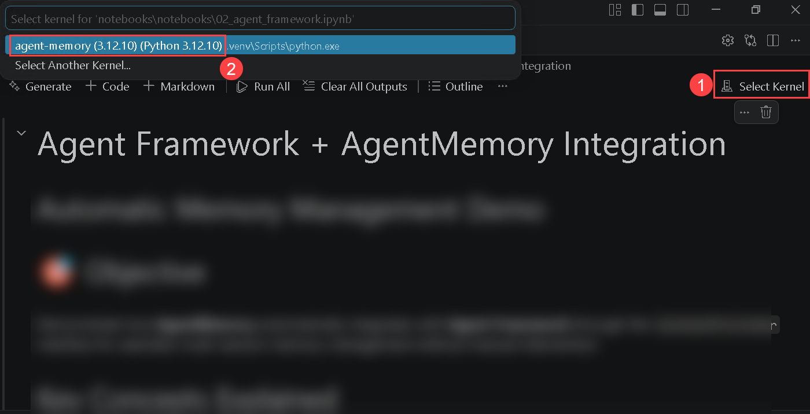

1. **Run** the first code cell under **Steps 1–6: Setup, Configuration & Agent Initialization**. This cell prepares the notebook by loading the project configuration, validating the required Azure OpenAI environment variables, creating the local SQLite database, initializing **Agent Memory**, and configuring the financial advisor agent with its tools and automatic memory integration.

   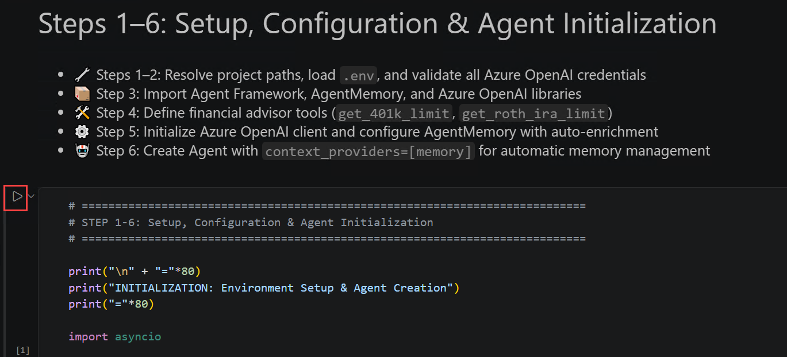

1. After the cell executes successfully, verify that the output confirms the environment configuration, Agent Memory initialization, and agent creation, and that it ends with the message **`✅ INITIALIZATION COMPLETE - Agent ready for conversations!`**, as shown in the following image.

   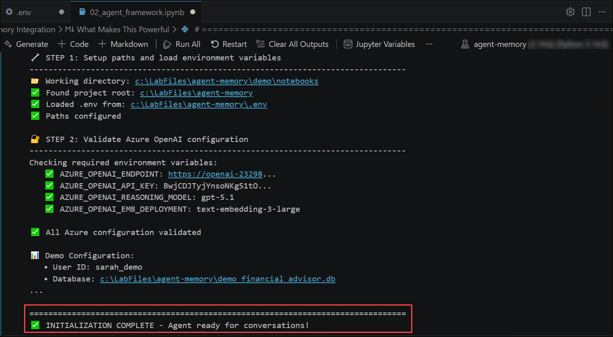

1. **Run** the first code cell under **"Step 7–8: Run Three-Session Demo"**. This demonstration simulates three conversations with the financial advisor agent, showing how **Session 1** builds Sarah's profile, **Session 2** automatically recalls information from the previous session, and **Session 3** uses the accumulated knowledge to provide more personalized responses.

   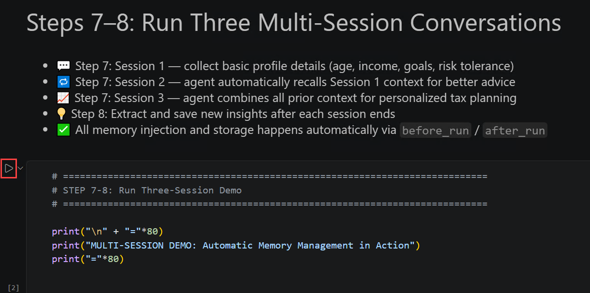

1. After the code cell executes successfully, verify that the output shows **`✅ ALL SESSIONS COMPLETE`**, followed by the three-session summary. Also, observe the **`💡 Insights extracted`** count after each session, confirming that Agent Memory automatically reflects on the conversation and updates the user's long-term profile.

   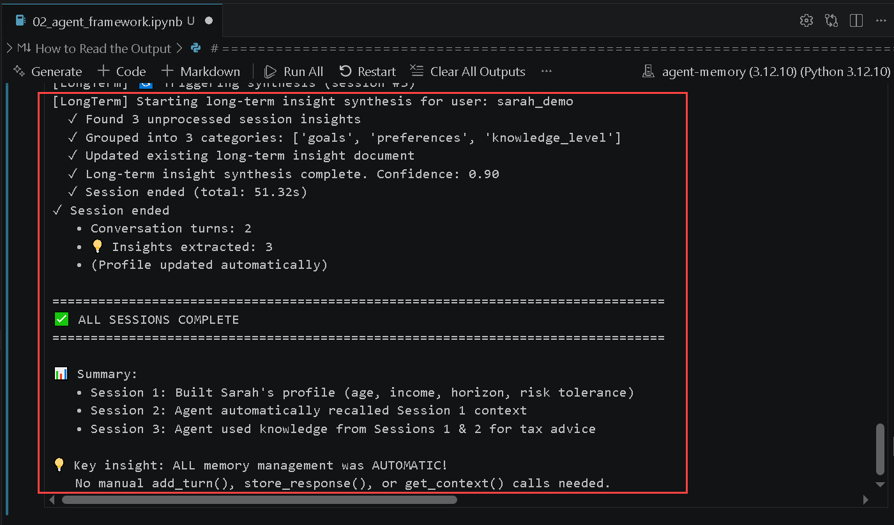

1. Review the outputs from **Session 2** and **Session 3** and verify that the agent automatically recalls information established in **Session 1**, rather than responding as if it were a new conversation.

1. In the output, identify examples of this memory recall. In **Session 2**, observe the agent referencing Sarah's **risk tolerance** or **30-year time horizon** when recommending an investment strategy. In **Session 3**, observe the agent using Sarah's **$150,000 income** or the **retirement accounts discussed earlier** when providing tax optimization advice.

   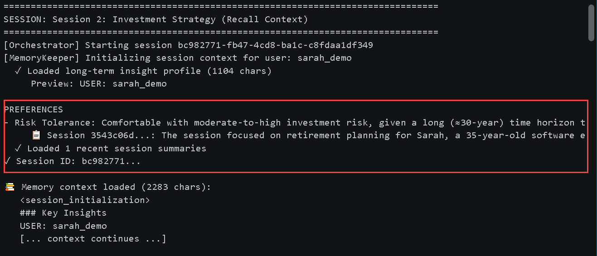

   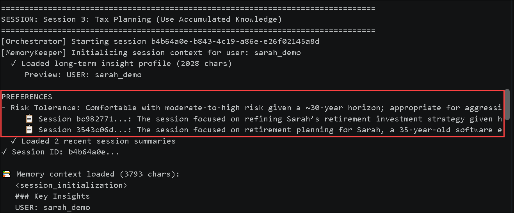

   >**Note**: To verify the complete output block, scroll down to the end of the output and click on **scrollable element**.

1. Run the final code cell under **Step 9–10: Inspect Memory & Cleanup**. This cell inspects the stored memory by performing a semantic search, displaying the user's long-term profile and recorded session summaries, and then cleans up the demo environment by closing the memory connection and removing the local SQLite database.

   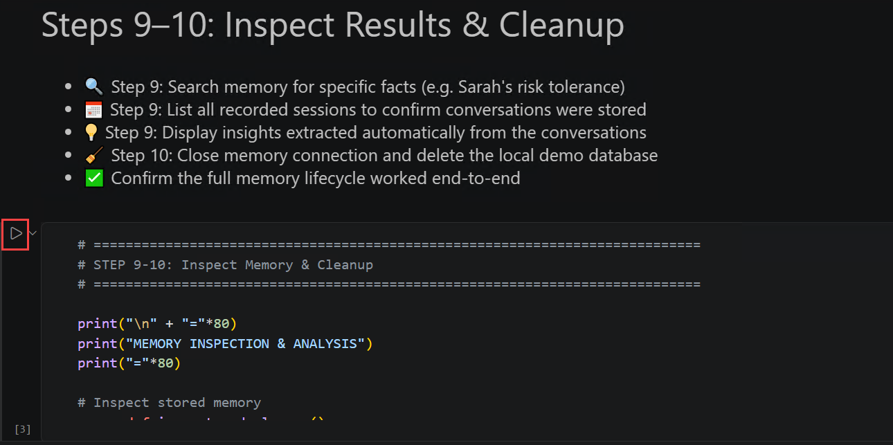

1. After the code cell executes successfully, verify that the **Memory Search Test** runs `memory.search("What is Sarah's risk tolerance?")` and successfully retrieves Sarah's previously stored information. Also, verify that the output displays the long-term profile and recorded session summaries, confirming that Agent Memory automatically stored, retrieved, and managed conversation history throughout the demo.

   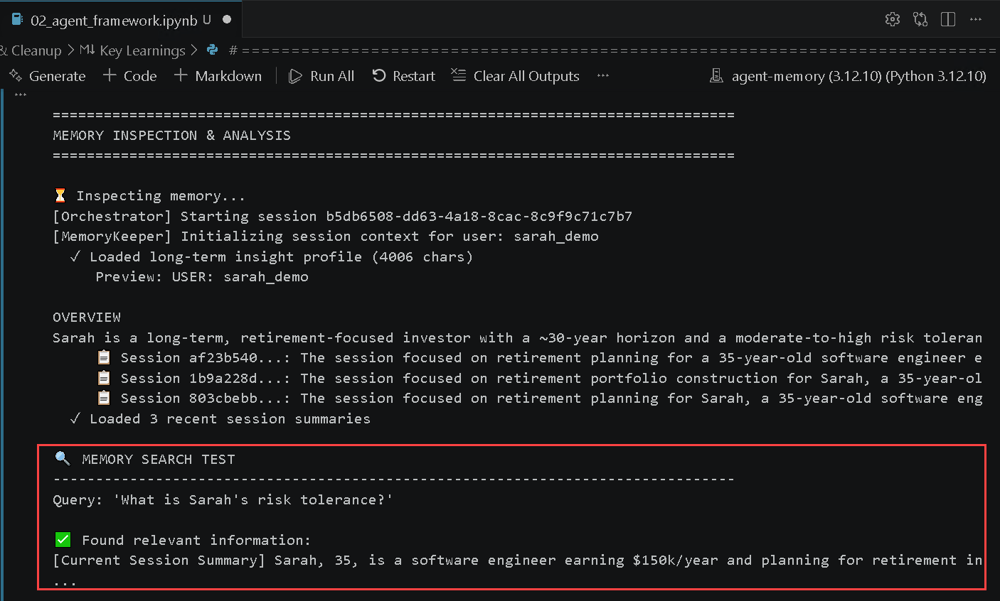

## Task 3: Compare Agent-Driven Memory Retrieval

In this task, you will run the agent-driven notebook, where automatic context injection is disabled and the agent must explicitly decide when to search memory — and observe a safety-critical scenario that tests whether it does.

1. In the Explorer pane, navigate to the  **notebooks (1)** folder and open the **03_agent_driven.ipynb (2)** notebook 

   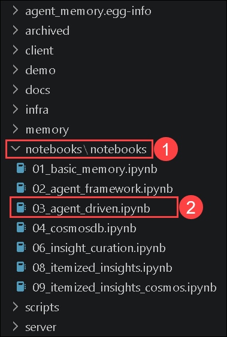

1. Read the first markdown cell, **"Agent-Driven Memory Demo"**. It contrasts the two approaches directly:

   - **Managed context (previous notebook):** the system automatically decides when to search; the agent passively receives pre-enriched context.
   - **Agent-driven (this notebook):** the agent has explicit memory tools and decides for itself when to call them — making memory access transparent, auditable, and reasoned.

   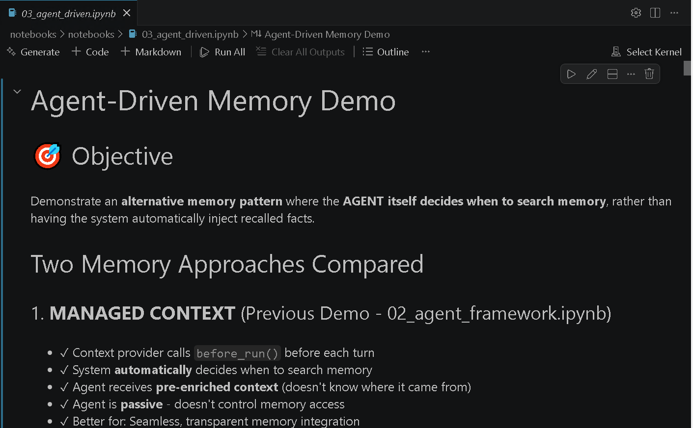

1. Scroll down into the notebook and review the **AgentMemoryConfig** section and notice that `auto_enrich_context=False` disables automatic context injection. Unlike the previous notebook, the agent does not automatically receive previous conversation context and must explicitly retrieve it using memory tools.

   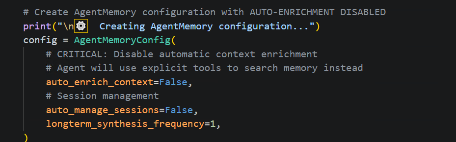

1. In the **03_agent_driven.ipynb** notebook, click **Select Kernel (1)** in the top-right corner and choose **agent-memory(3.12.X)(Python 3.12.X) (2)** if prompted.

   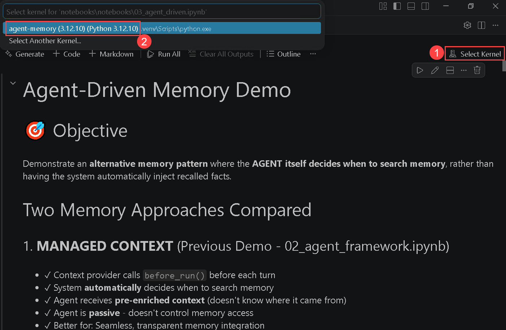

1. Run the first code cell under **Step 1: Setup, Imports & Configuration**. This cell prepares the demo environment by loading the project configuration, validating the Azure OpenAI settings, creating the Agent Memory configuration with **automatic context enrichment disabled**, and initializing the Agent Memory instance for the agent-driven memory demonstration.

   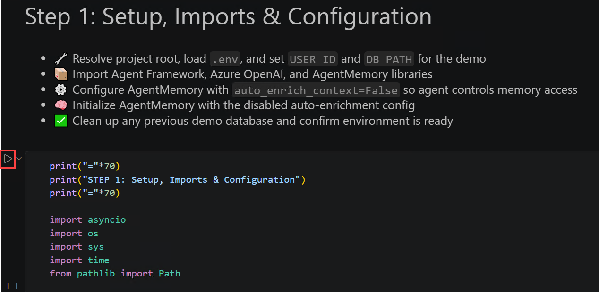

1. After the code cell executes successfully, verify that the output ends with **`✅ Step 1 Complete: Environment configured`** and confirms that Agent Memory was initialized with **auto-enrichment disabled**.

   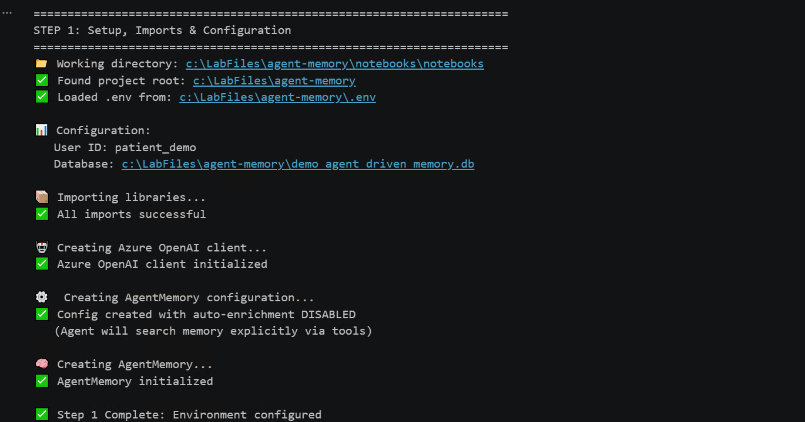

1. Run the next code cell under **Step 2: Create Memory Tools & Agent with Explicit Memory Control**. This cell creates the **`search_memory()`** and **`get_patient_profile()`** tools, configures the Azure OpenAI chat client, and initializes the agent with explicit memory tools instead of automatic context injection.

   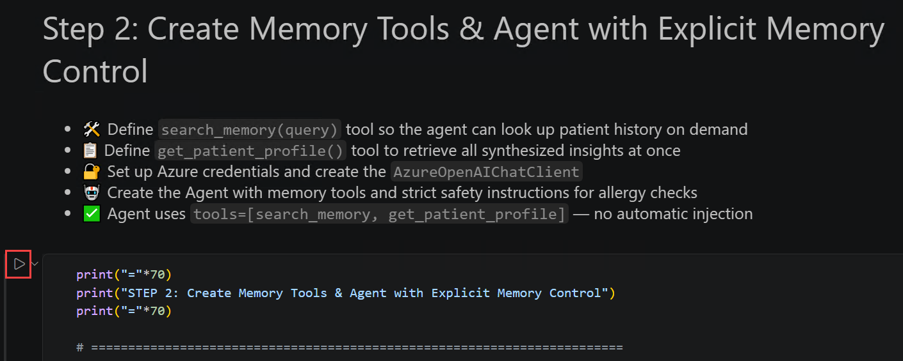

1. After the code cell executes successfully, verify that the output confirms the memory tools were created, the agent was initialized with explicit memory control, and the message **`✅ Step 2 Complete: Agent ready with memory control`** is displayed.

   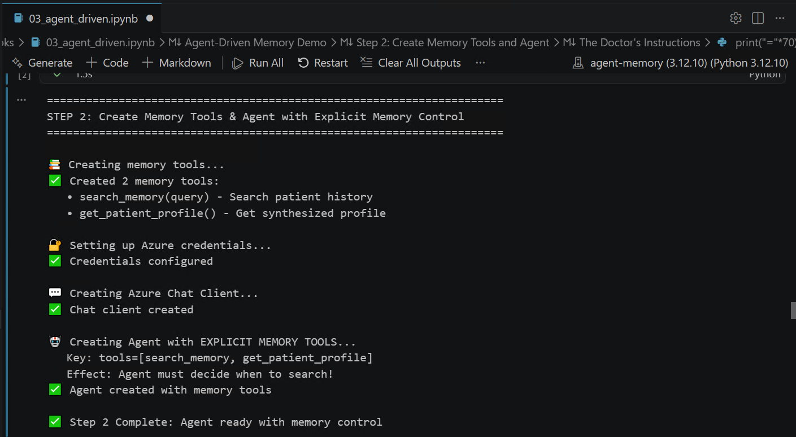

1. Run the next code cell under **Step 3: Run Three-Session Medical Demo**. This cell runs a three-session conversation where the agent uses its memory tools to decide when to retrieve the patient's medical history before responding.

   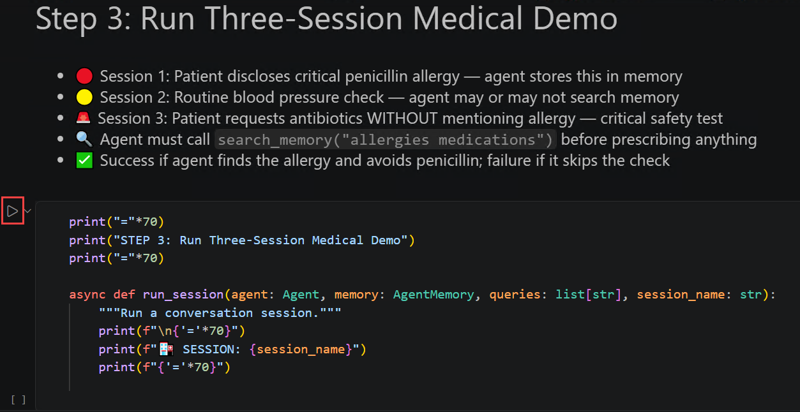

1. After the code cell executes successfully, verify that all three sessions complete successfully and the output ends with **`✅ Step 3 Complete: Multi-session demo finished`**.

   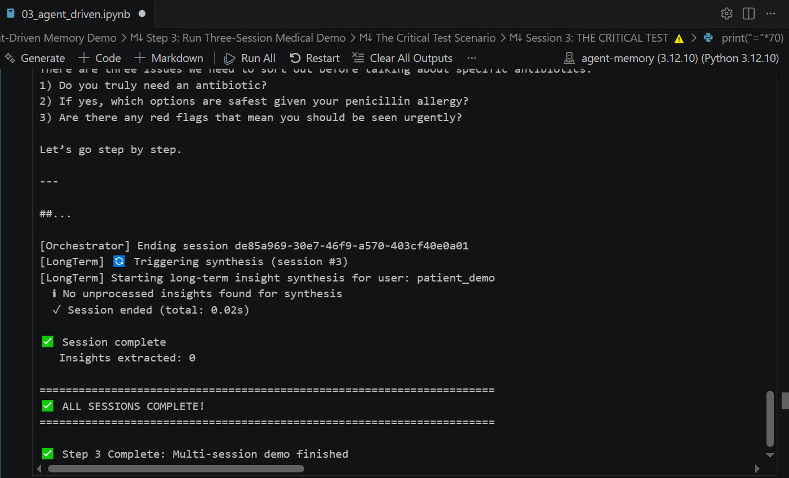 

1. Verify in the **Session 3** output that the agent explicitly invokes the **`search_memory`** tool to retrieve the patient's severe penicillin allergy from **Session 1** before providing medical guidance.

   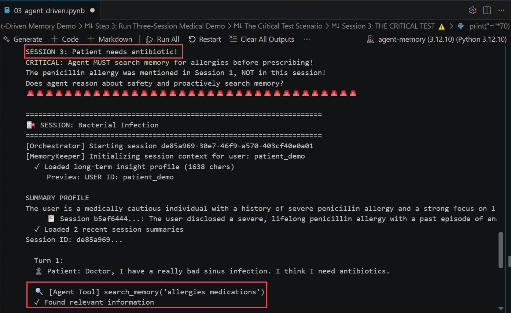

1. Run the final code cell **Step 4: Inspect Final Memory State & Key Learnings**. 

   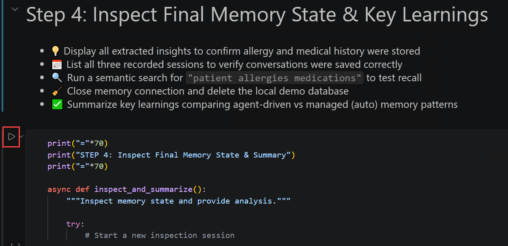 

1. This cell prints the extracted insights (the allergy should appear with its category and confidence), the three recorded sessions with summaries, a semantic search test for `"patient allergies medications"`, and then cleans up the database.

   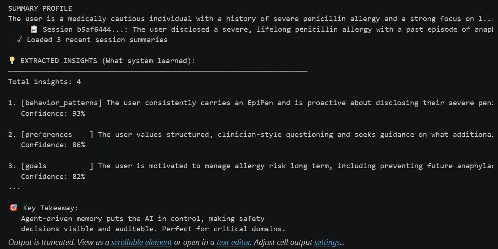 

1. Compare the two notebooks side by side by locating the concrete evidence of each pattern:

   - Open both notebooks in split view (right-click the **03_agent_driven.ipynb** tab and select **Split Right**).
   - In **02_agent_framework_condensed.ipynb**, observe that memory access is **invisible** in the session output — context simply appears in the `📚 Memory context loaded` line, with no tool calls shown. This is what "automatic" looks like: convenient, but you cannot see when or why memory was consulted.
   - In **03_agent_driven.ipynb**, observe the explicit `🔍 [Agent Tool] search_memory('...')` lines in the Session 3 output — every memory access is visible, logged, and attributable to an agent decision. This is what makes the agent-driven pattern easier to debug: if context was not recalled, the missing tool call shows you exactly where the failure happened.

1. Review the following comparison of the two patterns, and verify each row against what you observed in the outputs:

   | Pattern | Strength | Trade-off | Best-fit scenario |
   |---|---|---|---|
   | Framework-managed (`context_providers=[memory]`) | Seamless — zero memory code in the conversation flow; context always present | Opaque — cannot see when/why memory was used; may inject irrelevant context | Consumer assistants, advisors, and multi-turn experiences where continuity should feel natural |
   | Agent-driven (explicit `search_memory` tools) | Transparent and auditable — every access is a visible, logged tool call the agent must justify | Relies on the agent deciding to search; a missed search means missed context | Safety-critical domains (medical, legal, financial compliance) where memory access must be verifiable |

   > **Note:** The goal of this task is not to declare one pattern universally better. Instead, you are identifying when framework-managed context injection is helpful and when explicit retrieval offers better observability, safety, or control.

## Task 4: Long-Term Insight Extraction

In this task, you will run the insight curation notebook and observe how repeated sessions evolve into durable user understanding — including how the system resolves outright contradictions between sessions instead of blindly accumulating them.

1. In the Explorer pane, navigate to the  **notebooks (1)** folder and open the **06_insight_curation.ipynb (2)** notebook

   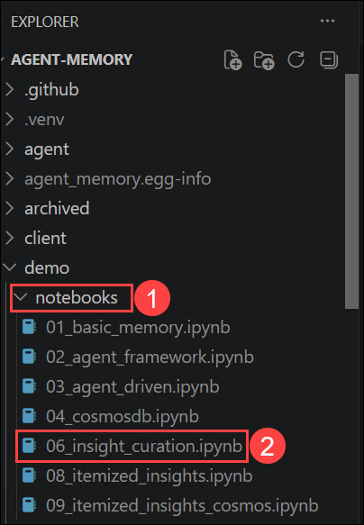

1. Read the first markdown cell, **"Insight Curation Demo: Contradiction Resolution & Profile Evolution"**. It demonstrates how Insight Curation updates a user's long-term profile when preferences change over time—for example, evolving from avoiding stocks to preferring an aggressive investment strategy—instead of storing conflicting insights.

   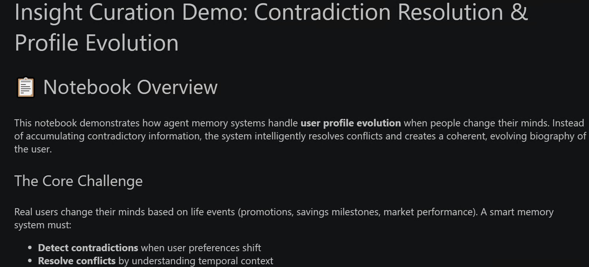

1. In the **06_insight_curation.ipynb** notebook, click **Select Kernel (1)** in the top-right corner and choose **agent-memory(3.12.X)(Python 3.12.X) (2)** if prompted.

   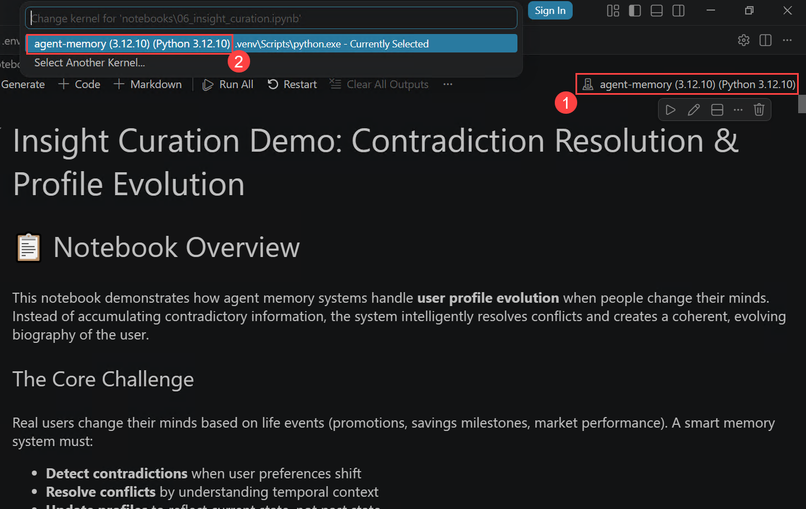

1. Run the first code cell **Step 1: Environment Setup & Configuration**. This cell loads the environment variables, initializes Agent Memory, creates the SQLite database (`demo_insight_curation.db`), and configures **`longterm_synthesis_frequency=1`** so that the long-term profile is synthesized after every session, enabling the system to detect and resolve conflicting insights across sessions.

   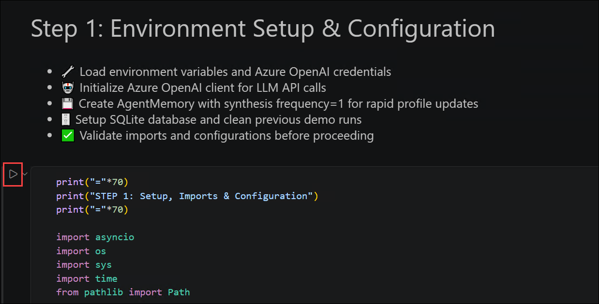

1. After the cell executes successfully, verify that the output confirms the environment configuration and ends with **`✅ Step 1 Complete: Environment configured`**

   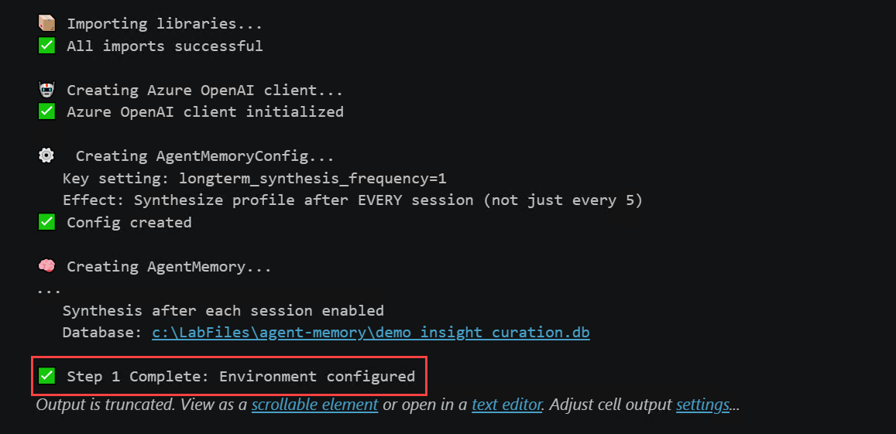

1. Run the next code cell **Step 2: Run Two Simulated Sessions – Demonstrating Profile Evolution**. This cell simulates two user sessions with changing investment preferences to demonstrate how Insight Curation detects and resolves contradictory information by updating the user's long-term profile.

   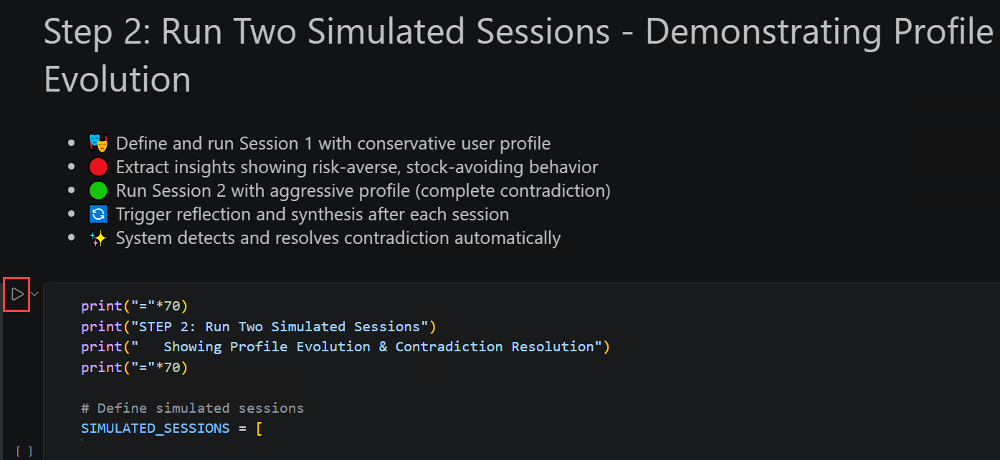

1. After the cell executes successfully, review the output and observe how the user's profile evolves from a conservative investor in **Session 1** to an aggressive investor in **Session 2**. Verify that the **Profile Evolution Summary** indicates the contradiction was resolved and that the output ends with **`✅ Step 2 Complete: Profile evolution demonstrated`**

   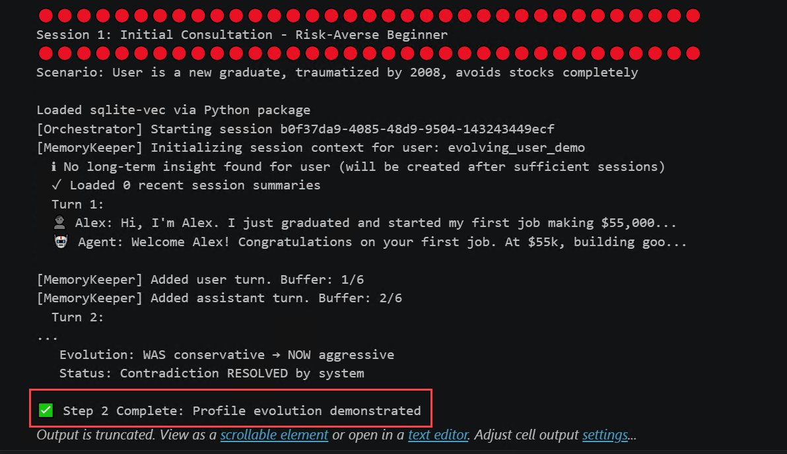

1. Read the next markdown cell, **"Step 3: Run Verification Session with Real LLM"**, and then run the code cell. This cell simulates a new investment scenario, retrieves Alex's curated long-term profile, and verifies that the LLM generates its recommendation based on the user's updated investment preference rather than the earlier conservative profile.

   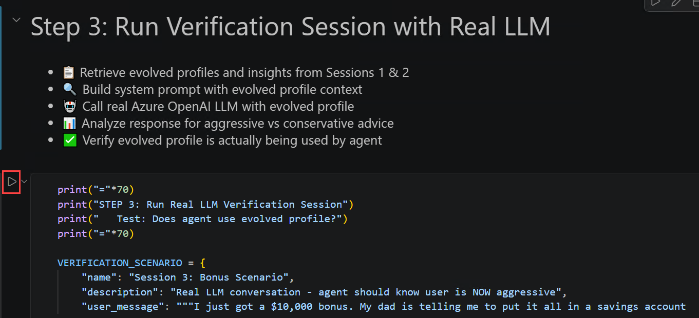

1. After the cell executes successfully, verify that the output indicates the model used Alex's updated aggressive investment profile and that the verification completes successfully. The output should end with:

   - **`✅ YES - Profile was used! Agent knows current stance.`**
   - **`✅ VERIFICATION COMPLETE`**
   - **`✅ Step 3 Complete: Profile evolution verified with real LLM`**

   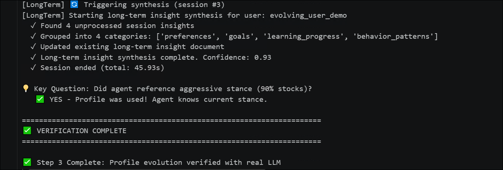

1. Run the final code cell **Step 4: Final Analysis & Key Learnings**.

      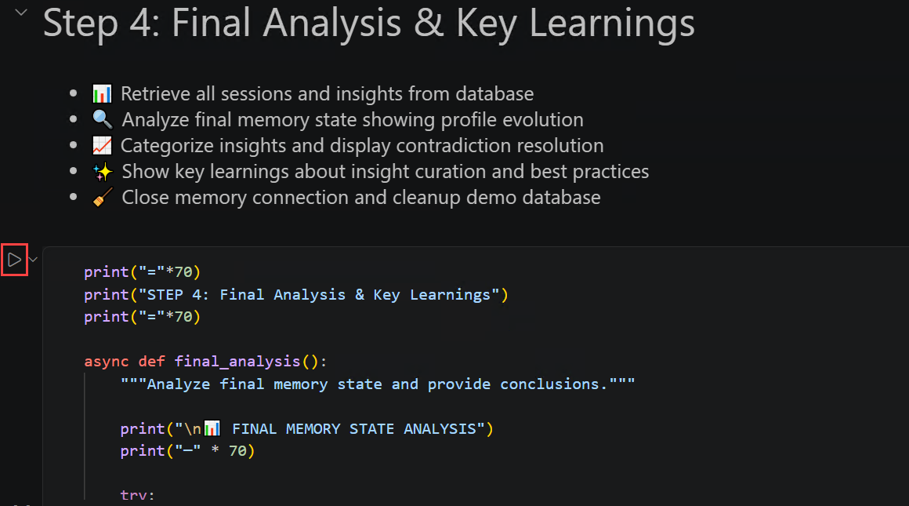

1. This cell categorizes the stored insights into **conservative**, **aggressive**, and **evolution/change** buckets, prints an explicit contradiction-resolution analysis, and cleans up the memory connection and database.

      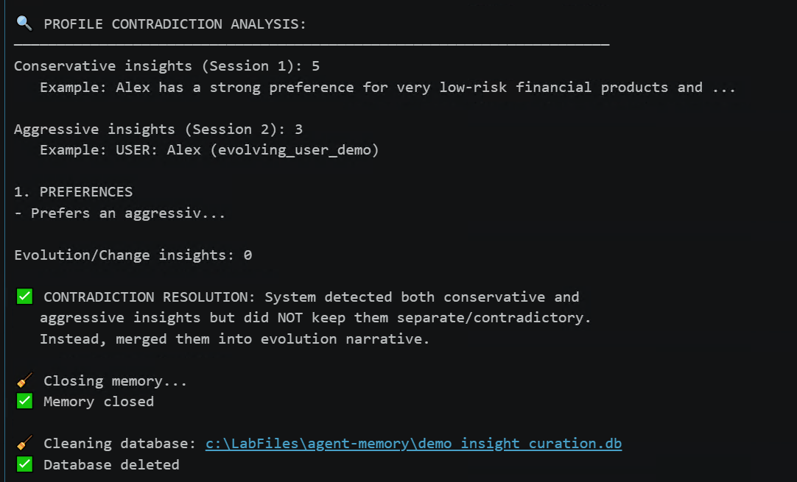

1. Review the four memory patterns demonstrated across the lab and identify where each one was implemented:

   - **Direct memory usage** — manual memory operations.
   - **Framework-integrated memory** — automatic context management through the Agent Framework.
   - **Agent-driven memory retrieval** — explicit memory searches initiated by the agent.
   - **Long-term insight curation** — profile evolution and contradiction resolution through long-term synthesis.

## 🧾 Summary

In this exercise, you explored three different approaches to integrating Agent Memory with AI agents. You examined the Agent Framework integration, where memory is managed automatically through lifecycle hooks, and verified that conversation context persisted seamlessly across multiple sessions without requiring manual memory operations. You also explored the agent-driven approach, where the agent explicitly invokes memory tools to retrieve relevant information only when needed.

Finally, you demonstrated long-term insight curation by observing how the system resolves contradictory user information and evolves a user's profile over time. By verifying the updated profile with a real LLM, you confirmed that synthesized long-term insights are used to generate more accurate, personalized, and context-aware responses across future conversations.

You have successfully completed this exercise. Click **Next >>** to continue to the next exercise.

   