# Exercise 3: Azure Cosmos DB Backend

### Estimated Duration: 75 Minutes

## 📘 Scenario

Contoso AI Solutions wants to extend its intelligent assistant platform with **cloud-backed memory**, allowing conversations and long-term insights to remain persistent and accessible beyond a single local environment. In the previous exercises, Agent Memory stored conversations and long-term insights in a local **SQLite** database. While this approach is ideal for development and learning, the data is stored only on the local machine, making it unsuitable for applications that need persistent, shared, or cloud-accessible memory.

In this exercise, you will migrate the same Agent Memory implementation to **Azure Cosmos DB** without changing the agent or conversation logic. You will verify that conversations and insights are stored in the cloud, explore how memory persists across sessions, and learn how bounded long-term memory keeps user profiles accurate by retaining the most relevant insights while gradually removing less useful information.

## 📖 Overview

In this exercise, you will configure Agent Memory to use Azure Cosmos DB, run the provided notebooks to store and retrieve conversation history from the cloud, verify the stored data in the Azure portal, and explore bounded long-term memory through itemized insights. You will also learn how changing only the storage backend allows the same agent and memory workflow to scale from local development to cloud-based applications.

## 🎯 Objectives

In this exercise, you will perform:

- Task 1: Understand Backend Options and configure CosmosDB 
- Task 2: Run the Cosmos DB Demo
- Task 3: Verify Data Persisted in Cosmos DB
- Task 4: Run Itemized Insights with Cosmos DB
- Task 5: Backend Selection Trade-offs (Read- Only)

## Task 1: Understand Backend Options and configure CosmosDB

In this task, you will learn what a **backend** means in Agent Memory, understand why Cosmos DB is needed for production workloads, confirm the Cosmos DB credentials in your `.env` file, and navigate to the pre-created Cosmos DB account in the Azure Portal.

### What is a backend?

A **backend** is where Agent Memory physically stores its data turns, summaries, session records, and insights. Think of it as the filing cabinet. The rest of the code (the agent, the memory API, the context injection) does not change when you swap the backend. You simply tell `AgentMemory` which type of database to use, and it handles the rest.

The project supports four backend options:

| Backend | Where data lives | Best for |
|---|---|---|
| `sqlite` | A `.db` file on your local machine | Learning, demos, local prototyping |
| `cosmosdb` | Azure cloud a managed JSON document database | Production agents, multi-session apps, cloud deployments |
| `azure_ai_search` | Azure cloud a search-optimized index | When semantic/vector retrieval quality is the top priority |
| `postgresql` | A SQL database (local or cloud) | Teams that already use Postgres in their stack |

> **Note:** In **Exercises 1 and 2**, you used **SQLite** as the local persistence backend. In this exercise, you switch to **Azure Cosmos DB** to explore cloud-backed memory persistence. Throughout this lab, the hands-on exercises focus on these two memory backends: **SQLite** for local storage and **Azure Cosmos DB** for cloud-based storage.

### What makes Cosmos DB different from SQLite?

| | SQLite | Cosmos DB |
|---|---|---|
| Where it runs | On your machine, as a file | In the Azure cloud |
| Who can access it | Only your local process | Any app, user, or service with credentials |
| What happens when you restart | Data stays on your machine | Data stays in the cloud always available |
| Cost | Free (a local file) | Azure consumption-based pricing |
| Best use | Prototyping | Production, multi-user, or deployed apps |

1. Open a browser on the lab VM and navigate to the Azure Portal:

   ```
   https://portal.azure.com
   ```

1. If it is prompted to signin, use below credentials

   - **Email/Username:** <inject key="AzureAdUserEmail"></inject>

   - **Temporary Access Pass:** <inject key="AzureAdUserPassword"></inject>

1. In the search bar at the top of the Azure Portal, search for **Azure Cosmos DB (1)** and select **Azure Cosmos DB (2)** from the Services section.

   

1. Select the **cosmos-<inject key="Deployment ID" enableCopy="false"></inject>**

   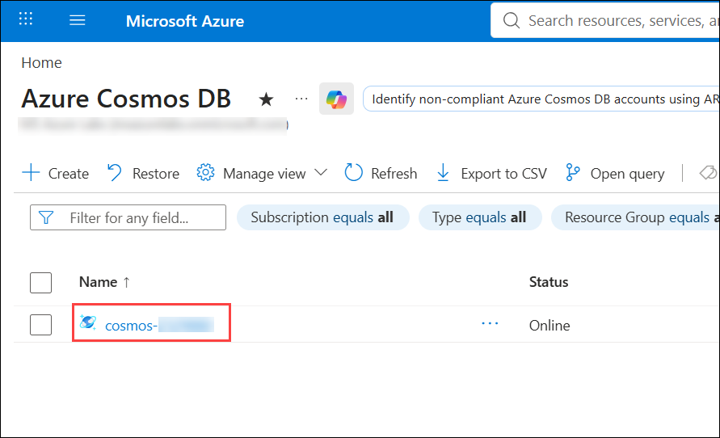

1. From the left navigation pane, expand **Settings (1)** and then select **Keys (2)**. Copy the **URI (3)** and paste it in Notepad.

1. Now copy the **Primary Key (4)** value and paste it in Notepad.

   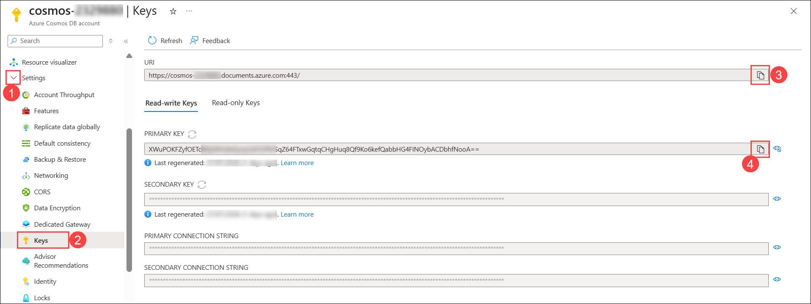

   > **Note:** Keys in the portal are hidden by default. Click the eye icon next to a key to reveal it.

1. Return to Visual Studio Code. In the Explorer pane, select `.env` and provide the following environment variables using the values you copied to Notepad:

   - **COSMOS_ENDPOINT**: Repalce the endpoint value you copied in Step 5.

   - **COSMOS_KEY**: Replace the API key you copied in Step 6.

      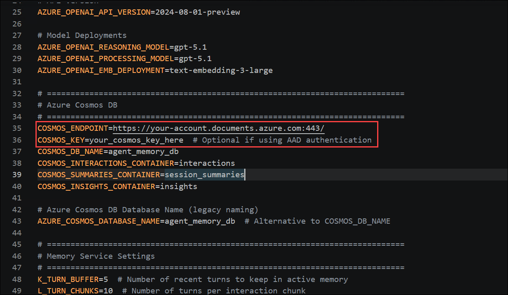

1. Save the changes made to the `.env` file by pressing **CTRL + S**.

## Task 2: Run the Cosmos DB Demo

In this task, you will open the **`04_cosmosdb.ipynb`** notebook and execute its code cells to explore how Agent Memory uses **Azure Cosmos DB** as the storage backend. You will run the same three-session financial advisor scenario from the previous exercise and observe how conversations, summaries, and long-term insights are persisted in the cloud instead of a local SQLite database.

1. In the Explorer pane, navigate to the  **notebooks (1)** folder and open the **04_cosmosdb.ipynb (2)** notebook.

   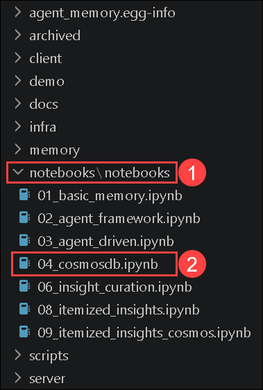

1. Read the first markdown cell, **"Demo 4: Financial Advisor with CosmosDB Backend"**. It introduces the financial advisor scenario, explains how Agent Memory uses **Azure Cosmos DB** to store conversation history across multiple sessions, and outlines the notebook flow, including cross-session recall, memory search, extracted insights, and session summaries. Also, verify that the required Azure OpenAI and Cosmos DB environment variables match those configured in the previous task.

   

1. Click **Select Kernel (1)** in the top-right corner and choose **agent-memory(3.12.X)(Python 3.12.X) (2)** if prompted.

   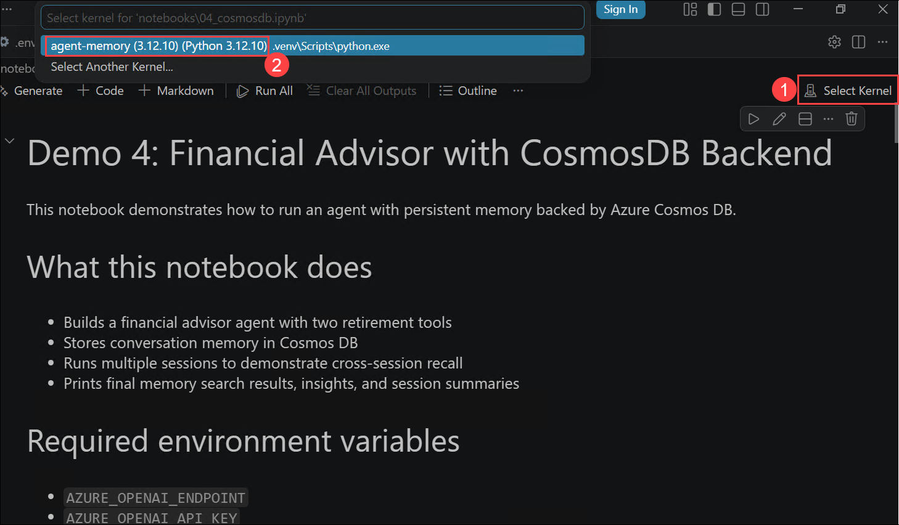

1. **Run** the first code cell (**Cell 1: Setup, Imports & Environment Configuration**). This cell imports the required libraries, loads the Azure OpenAI and Azure Cosmos DB settings from the **`.env`** file, configures the project environment, and initializes the demo using **`USER_ID = "sarah_demo_cosmos"`** so all conversation data is associated with the same user in Cosmos DB.

   

1. Verify that the output ends with **`Imports and environment setup complete.`**

   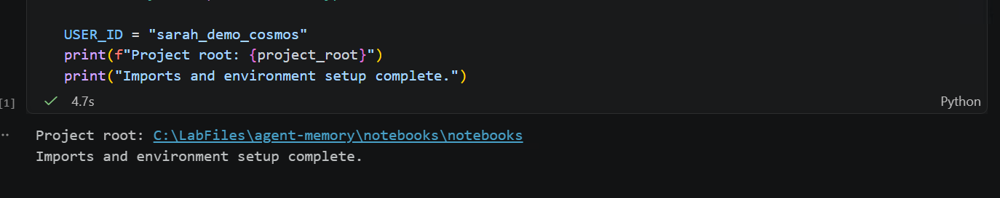

1. **Run** the second code cell **Cell 2: Tools, Session Runner & CosmosDB Memory Setup**. This cell creates the financial tools, configures Agent Memory to use **Azure Cosmos DB**, and defines the session runner that manages conversations and retrieves previously stored memory.

   

2. Verify that the output ends with **`Tools, session runner, and Cosmos memory client are ready.`** During the demo, notice that the amount of loaded memory context increases in later sessions as the agent retrieves Sarah's previously stored profile from Azure Cosmos DB.

   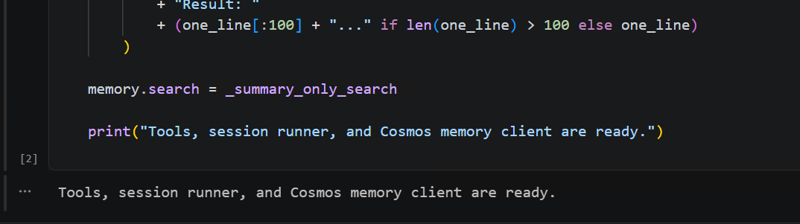

1. **Run** the final code cell (**Cell 3: Run Three Sessions Demo with CosmosDB Memory**). This cell connects to **Azure Cosmos DB**, runs the three-session financial advisor scenario, and stores Sarah's conversations, summaries, and long-term insights in the cloud.

   

1. Verify that the demo completes successfully. As the sessions progress, notice that the **Memory context loaded** value increases as previously stored information is retrieved from Azure Cosmos DB, enabling the agent to personalize its responses across sessions. Also confirm that the notebook performs a semantic memory search, lists the recorded session summaries and extracted insights.

   

   > **Note:** If the cell fails with a `CosmosDB connection error` or `authentication error`, verify your `COSMOS_ENDPOINT` and `COSMOS_KEY` values in `.env`, save the file, restart the kernel, and re-run all cells from the top.

> **Congratulations** on completing the task! Now, it's time to validate it. Here are the steps:
> - Hit the Inline Validate button for the corresponding task. If you receive a success message, you can proceed to the next task.
> - If not, carefully read the error message and retry the step, following the instructions in the lab guide.
> - If you need any assistance, please contact us at cloudlabs-support@spektrasystems.com. We are available 24/7 to help.
 
<validation step="98bd516c-1e42-45a7-9fe4-ec8c58bafe5d" />

## Task 3: Verify Data Persisted in Cosmos DB

In this task, you will confirm that the data written in Task 2 actually exists in your Azure Cosmos DB account by browsing the containers in Data Explorer, inspecting a stored JSON item, and verifying that memory survives a full kernel restart.

1. Return to your browser and in the search bar at the top of the Azure Portal, search for **Azure Cosmos DB (1)** and select **Azure Cosmos DB (2)**.

   

1. Select the **cosmos-<inject key="Deployment ID" enableCopy="false"></inject>**

   

1. From the left navigation pane, select **Data Explorer**.

   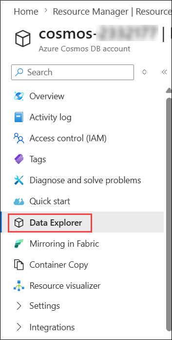

   >**Note:** If you get any pop-up. please close it.

1. In the Data Explorer, expand the **agent_memory_db** database node. Inside **agent_memory_db**, expand each container to see what the demo created. You should find containers similar to the following:

   - **interactions** - the raw conversation turns (Sarah's questions and the advisor's answers).
   - **session_summaries** - the auto-generated summaries produced at the end of each session.
   - **insights** - the durable facts extracted about Sarah (risk tolerance, income, retirement timeline, etc.).

      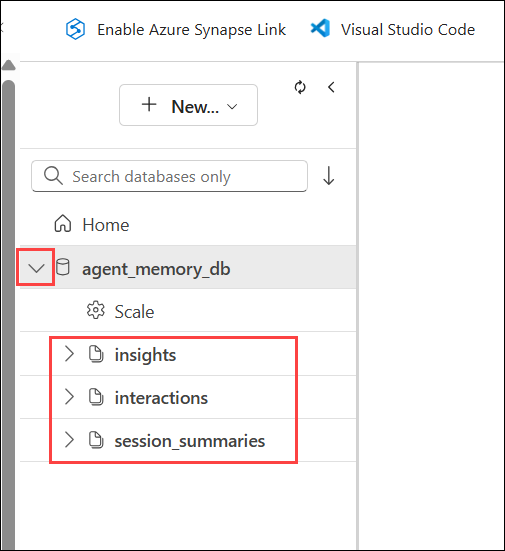

1. Expand the **interactions (1)** container, select **Items (2)**, and open any JSON document **(3)**. Verify that the `user_id` is **`"sarah_demo_cosmos"`**, matching the notebook's `USER_ID`, and that the document contains the conversation data generated during Task 2.

   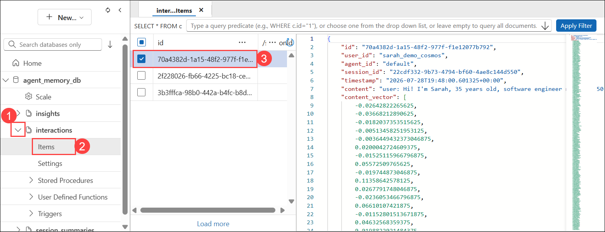

   > **Note:** In Azure Cosmos DB for NoSQL, every piece of data is stored as a JSON document inside a **container** (similar to a table in SQL, but schema-free). Each document has a unique `id` and a `partition key` in this project, the partition key is the `user_id`, which means all of Sarah's data is grouped together for efficient retrieval.

1. Click on the **insights (1)** container → **Items (2)** and open one of the insight documents **(3)**. Confirm it contains a fact extracted from the conversation.

   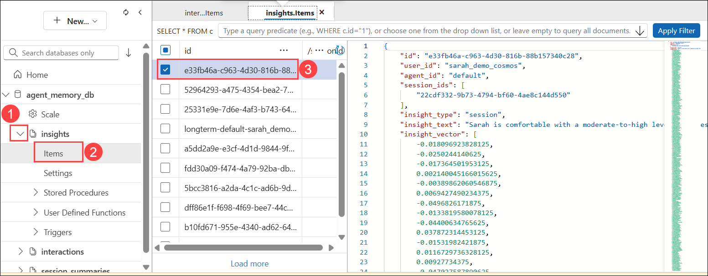

1. Now verify **cross-run persistence**, this is the most important part. Return to Visual Studio Code, and **restart the notebook kernel** by clicking the **Restart** button in the notebook toolbar.

   

1. Run only the first two cells again (**Cell 1: Setup, Imports & Environment Configuration and Cell 2: Tools, Session Runner & CosmosDB Memory Setup**) to reinitialize the environment. Do **not** run the **Cell 3: Run Three Sessions Demo with CosmosDB Memory**.

   

   

1. Click on  **+code** above **Cell 3: Run Three Sessions Demo with CosmosDB Memory** and run the following snippet to confirm prior data is accessible immediately after a fresh kernel start:

   

1. Add the following code snippet **(1)** then click the **Run Cell** button **(2)**.

   ```python
   result = await memory.search("What is Sarah's risk tolerance?")
   print(result)
   ```

   

1. Review the output **(3)** and verify that it returns Sarah's **moderate-to-high risk tolerance** from **Session 1**. This confirms that Agent Memory successfully retrieves persisted data from **Azure Cosmos DB**, even after starting a new kernel with no in-memory conversation state.

   > **Note:** This is the key difference from SQLite: with SQLite, persistence is local to the machine. With Cosmos DB, a completely separate application running anywhere a web API, a mobile app, another engineer's laptop would get the same answer from the same data.

## Task 4: Run Itemized Insights with Cosmos DB

In this task, you will run the `09_itemized_insights_cosmos.ipynb` notebook. This notebook introduces a more advanced memory concept: **bounded long-term memory** a system where the agent can only keep a fixed number of insights at any time, and older or less-used insights are automatically removed to make room for newer, more relevant ones.

### Why bounded memory?

Imagine an agent that has been talking to a user for two years. If every insight from every session accumulates forever, the agent's memory grows without limit eventually injecting so much context into every prompt that it becomes slow, expensive, and noisy. Bounded memory solves this by applying three scoring rules to decide which insights to keep:

- **Recency** - a new insight gets a temporary priority boost so it is not immediately dropped.
- **Frequency** - an insight that is referenced again in later sessions gets stronger (its `access_count` rises).
- **Forgetting** - an insight that is never referenced again gradually decays and is eventually pruned.

This notebook simulates six months of client sessions, capped at `MAX_INSIGHTS = 5`, and shows how the insight table evolves over time.

1. In the Explorer pane, navigate to the  **notebooks (1)** folder and open the **09_itemized_insights_cosmos.ipynb (2)**.

   

1. Click **Select Kernel (1)** in the top-right corner and choose **agent-memory(3.12.X)(Python 3.12.X) (2)** if prompted.

   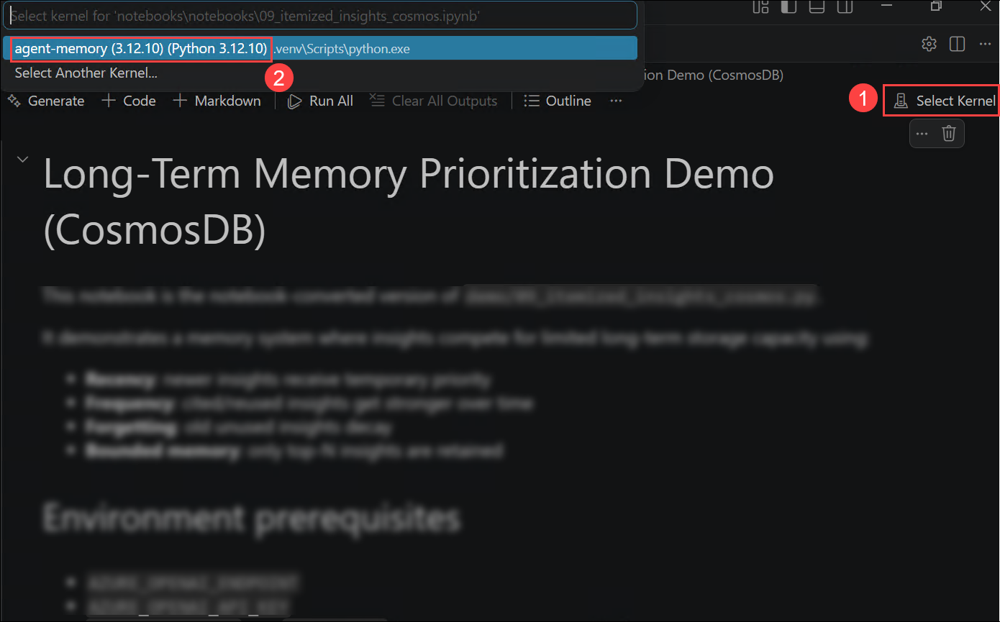

1. **Run** the first code cell **Cell 1: Environment Setup & Configuration**. This cell loads the project environment, imports the Cosmos DB and insight curation components, sets the demo configuration (`USER_ID = "memory_priority_demo_cosmos"` and `MAX_INSIGHTS = 5`), and defines the six-session timeline used to demonstrate how long-term insights evolve over time.

   

2. Verify that the setup completes successfully and the output ends with **`Setup complete.`**

   

1. **Run** the second code cell **Cell 2: Helper Functions for Insight Management**. This cell creates the helper functions used throughout the demo to retrieve, display, rank, and prune long-term insights stored in **Azure Cosmos DB**.

   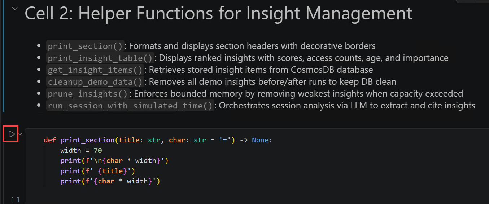

2. Verify that the output ends with **`Helper functions are ready.`** The helper functions will be used later in the notebook to display insight tables showing each insight's **retention score**, **access count**, **age**, **importance**, and **content**, retrieve insights from Cosmos DB, remove existing demo data before each run, and automatically rank and prune insights so that only the highest-priority items are retained.

   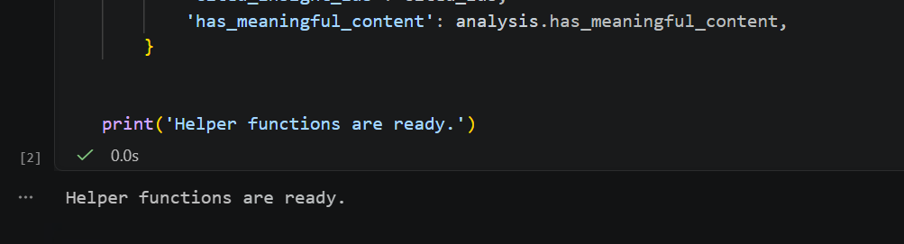

1. **Run** the final code cell (**Cell 3: Execute Full 6-Month Memory Simulation**). This cell simulates six months of conversations for Alex, extracting new insights after each session, ranking them by retention score, and automatically pruning lower-priority insights once the memory limit (`MAX_INSIGHTS = 5`) is exceeded.

   

2. Observe how the memory evolves throughout the simulation. Before each session, the notebook displays the current insight table. After processing the session, it extracts new insights, updates the retention scores of previously referenced insights, and, when necessary, removes the lowest-priority insights to keep memory within the configured limit. By the final session, notice how frequently referenced insights are retained while older or less relevant ones are pruned, resulting in a concise, high-value long-term memory.

   

1. Compare the two notebooks and identify the **main difference** in how they manage long-term insights:

   - **`04_cosmosdb.ipynb`** stores and retains all extracted insights, allowing the knowledge base to grow over time.
   - **`09_itemized_insights_cosmos.ipynb`** implements **bounded memory**, limiting the total number of retained insights to `MAX_INSIGHTS = 5` by ranking and pruning lower-priority insights.

## Task 5: Backend Selection Trade-offs (Read- Only)

In this task, you will verify the four supported backends in the project's codebase, review a complete comparison table

### Verify the four backend types in the code

1. In Visual Studio Code Explorer pane, navigate to **memory/db/** and open the file `factory.py`.

   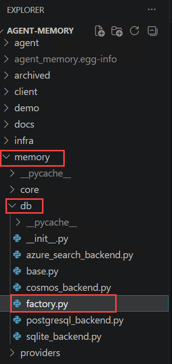

1. Confirm the four backend values appear in the code:

   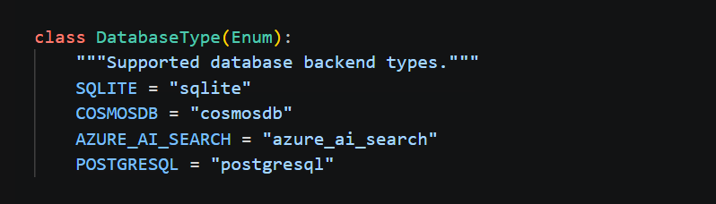

### Review the backend comparison

Review the following table.

| Backend | Where data lives | Best fit | Strength | Limitation |
|---|---|---|---|---|
| **SQLite** | A `.db` file on your local machine | Local dev, demos, single-machine prototyping | Zero configuration works immediately with no credentials | Data is tied to one machine; no other app or user can access it |
| **Cosmos DB** | Azure cloud managed JSON document store | Production agents, multi-session apps, cloud deployments | Durable cloud persistence, globally available, JSON-native, serverless option | Requires Azure credentials and incurs cloud cost |
| **Azure AI Search** | Azure cloud  search-optimized index | When semantic/vector retrieval quality is the priority | Best-in-class hybrid (keyword + vector) retrieval | Higher setup complexity; less suited as a general-purpose store |
| **PostgreSQL** | SQL database (local or cloud-hosted) | Teams already standardizing on relational storage | Familiar SQL tooling, strong operational ecosystem | Requires schema management; less natural for JSON/vector workloads |

## 🧾 Summary

In this exercise, you explored how Agent Memory uses **Azure Cosmos DB** as a cloud-backed storage backend, compared it with the other supported storage options, and verified the required connection settings. You ran the financial advisor demo to observe cross-session memory persistence, validated the stored conversations, summaries, and insights directly in the Azure Portal, and confirmed that memory remains available across notebook executions. You then explored bounded long-term memory by running the insight curation demo, observing how insights are ranked, retained, and pruned to maintain a maximum of five high-value memories. Finally, you verified that migrating from SQLite to Azure Cosmos DB requires only a backend configuration change, while the agent behavior and memory logic remain unchanged.

You have successfully completed this exercise. Click **Next >>** to continue to the next exercise.

   
