# Exercise 4: Bounded Long-Term Memory (SQLite) & Insight Curation

### Estimated Duration: 60 Minutes

## 📘 Scenario

In the previous exercises, you explored how Agent Memory stores information using **SQLite**, allowing conversations and long-term insights to persist across sessions. While this works well, continuously storing every extracted insight eventually causes memory to grow indefinitely, making it more expensive to maintain and increasing the likelihood of retaining outdated or less relevant information.

In this exercise, you will explore two complementary strategies for managing long-term memory. First, you will examine **bounded memory**, where the number of retained insights is limited by ranking and pruning lower-priority information. You will then compare this with **insight curation**, which focuses on resolving contradictory insights and updating a user's evolving profile instead of simply accumulating or deleting information. Together, these approaches demonstrate different techniques for keeping long-term memory accurate, relevant, and efficient.

## 📖 Overview

In this exercise, you will run the **`08_itemized_insights.ipynb`** notebook to observe how bounded memory retains only the highest-priority insights using recency, frequency, forgetting, and a configurable memory limit. You will then compare its behavior with the **`06_insight_curation.ipynb`** notebook to understand how contradiction resolution differs from bounded memory and identify the scenarios where each approach is most appropriate.

## 🎯 Objectives

In this exercise, you will perform:

- Task 1: Understand the Itemized Insights Pattern
- Task 2: Run Itemized Insights Demo (SQLite)
- Task 3: Compare Synthesis Strategies

## Task 1: Understand the Itemized Insights Pattern

In this task, you will learn what bounded memory means, understand the four scoring rules the notebook uses, and open the notebook to inspect its configuration before running any cells.

### What does "bounded" mean?

**Unbounded memory** — every insight the agent extracts is stored forever. After 100 sessions, the agent has hundreds of insights. Many of them are stale, redundant, or no longer accurate. The agent injects all of them into every prompt, which wastes tokens and degrades response quality.

**Bounded memory** — you set a hard ceiling, for example `MAX_INSIGHTS = 5`. The agent can never hold more than 5 insights at any time. When a new insight arrives and the count would exceed 5, the *least valuable* existing insight is permanently deleted to make room. This forces the memory to stay compact and relevant.

### How does it decide which insights to delete?

The notebook scores every insight using four rules, then deletes the lowest-scoring one:

| Rule | What it means | Effect |
|---|---|---|
| **Recency** | A brand-new insight gets a temporary boost | Protects new information from being immediately discarded |
| **Frequency** | Every time an insight is *cited* in a later session, its `access_count` increases | Insights that keep proving useful become stronger over time |
| **Forgetting** | An insight that is never cited again slowly decays | Old, never-referenced insights gradually weaken |
| **Bounded Capacity** | If total insights exceed `MAX_INSIGHTS`, delete the weakest | Enforces the hard cap |

The result is a memory system that behaves like human long-term memory: frequently-used facts stay sharp, and old unused details fade away.

1. In the Explorer pane, navigate to the  **notebooks (1)** folder and open the **08_itemized_insights.ipynb (2)** notebook.

   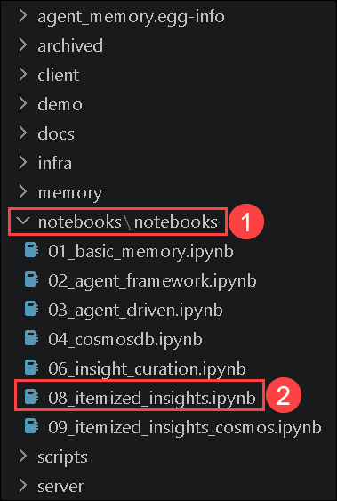

1. Read the first markdown cell, **"Long-Term Memory Prioritization Demo (SQLite)"**. Confirm it lists the same four concepts described above: **Recency**, **Frequency**, **Forgetting**, and **Bounded Capacity**.

   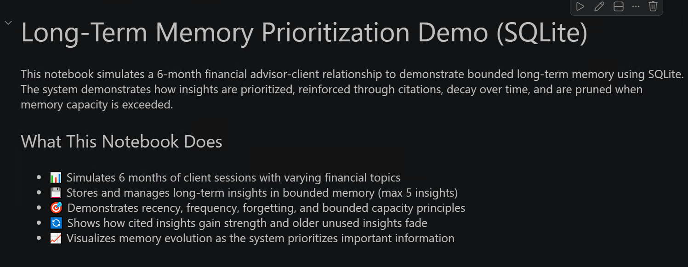

1. Click **Select Kernel (1)** in the top-right corner and choose **agent-memory(3.12.X)(Python 3.12.X) (2)** if prompted.

   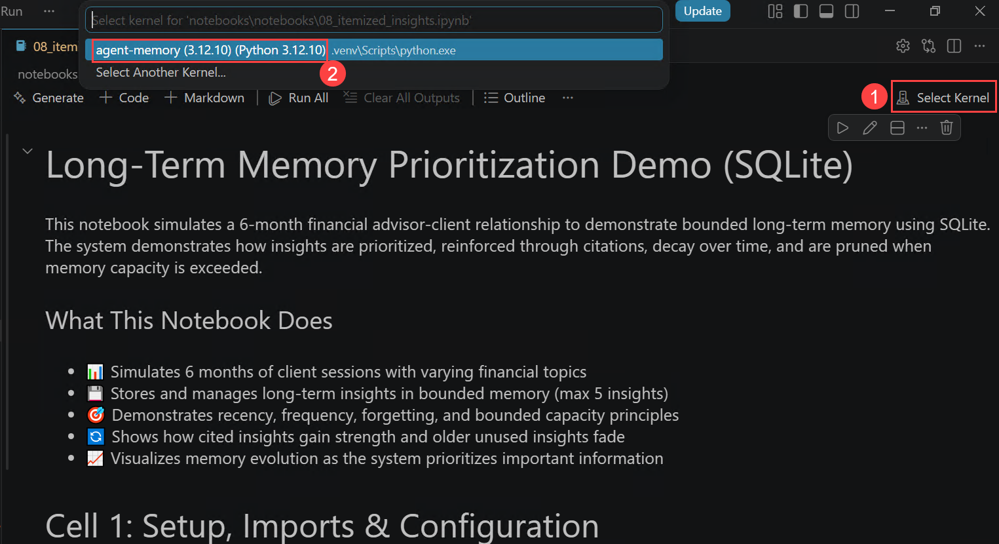

1. Before running any cells, scroll to **Cell 1** and locate the **`USER_ID`** and **`MAX_INSIGHTS`** configuration values. Note that **`USER_ID`** identifies the fictional user whose memory is managed throughout the demo, while **`MAX_INSIGHTS = 5`** sets the maximum number of long-term insights the system will retain at any time.

   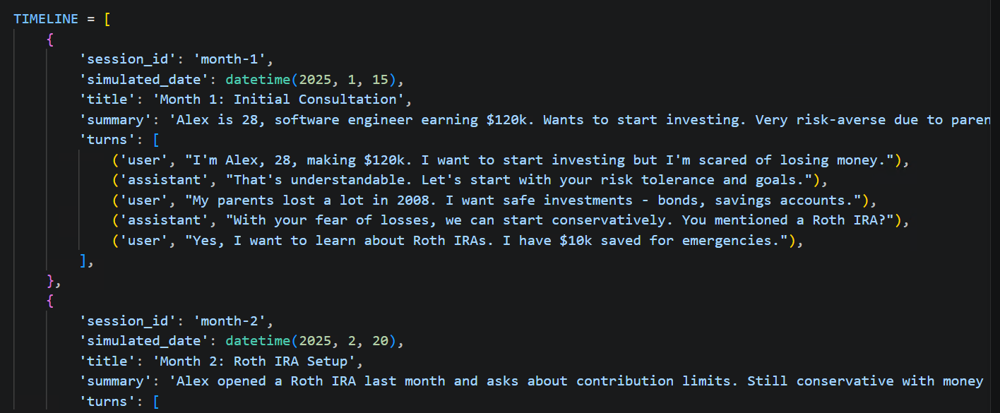

2. Continue reviewing **Cell 1** and examine the **`TIMELINE`** list. It contains six simulated monthly sessions (January–June 2025), each defining a session date, title, summary, and the corresponding user-assistant conversation that will be processed later to demonstrate how insights are created, ranked, and retained over time.

   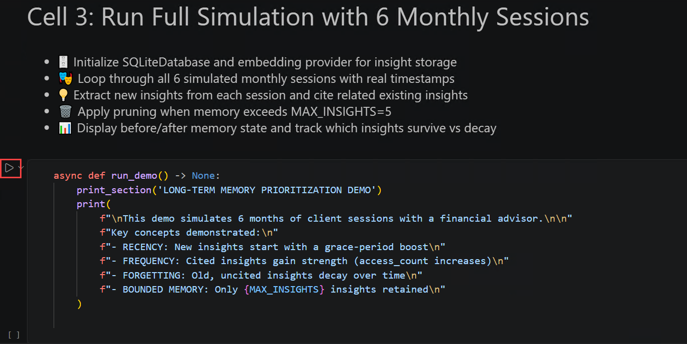

1. Read the markdown cell **"Cell 3: Run Full Simulation with 6 Monthly Sessions"** to preview what will happen when you run the main cell. It outlines five steps: reset state → initialize storage → simulate six sessions → extract and reinforce memory → apply pruning.

## Task 2: Run Itemized Insights Demo (SQLite)

In this task, you will execute the three code cells in `08_itemized_insights.ipynb` one by one and observe how the insight table evolves — with entries being added, strengthened, and pruned — across six simulated sessions.

1. Run the first code cell (**Cell 1: Setup, Imports & Configuration**). This cell loads the project environment, initializes the Azure OpenAI client, configures the local SQLite database, and defines the six-month timeline that will be used to demonstrate bounded memory and insight prioritization.

   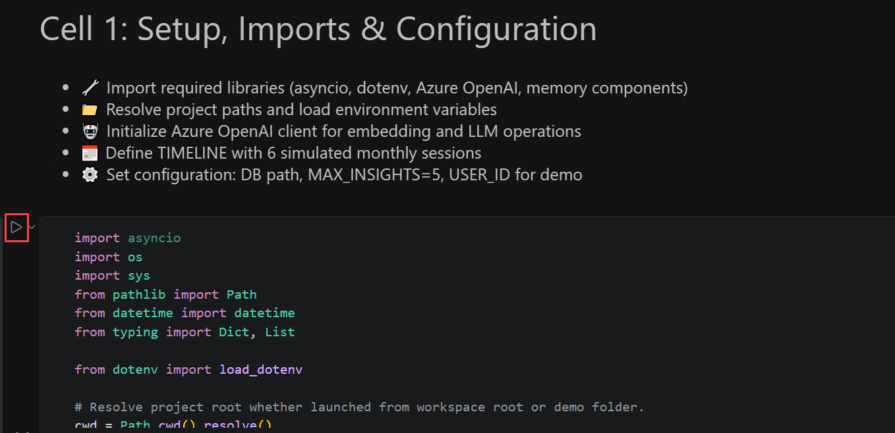

2. Verify that the output ends with **`Setup complete.`** Unlike the previous notebooks, this demo works directly with the SQLite database and reflection engine instead of the high-level **AgentMemory** wrapper, exposing the underlying insight extraction, scoring, and pruning process. Also note that the local **`demo_memory_priority.db`** database is recreated for each run to ensure consistent results.

   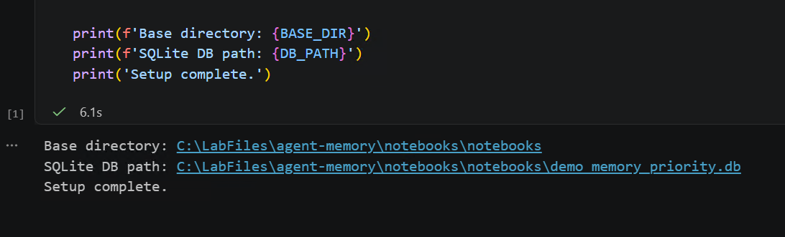

1. Run the second code cell **Cell 2: Helper Functions**. This cell creates the helper functions used throughout the demo to display, retrieve, rank, and prune long-term insights stored in the local SQLite database.

   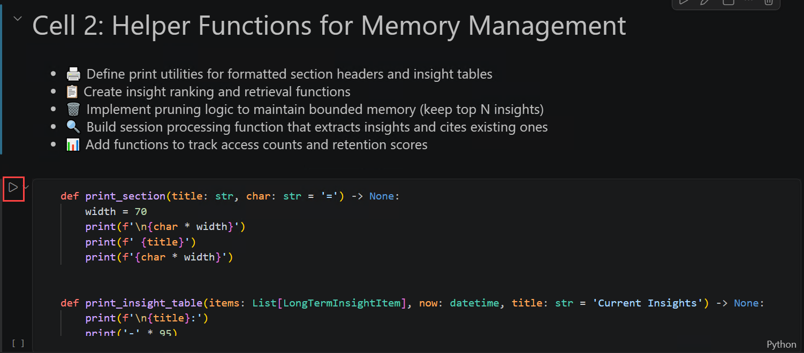

2. Verify that the output ends with **`Helper functions are ready.`** These helper functions will be used later to display insight tables with each insight's **retention score**, **access count**, **age**, **importance**, and **content**, retrieve insights from the database, process each simulated session, and automatically rank and prune lower-priority insights when the configured memory limit is exceeded.

   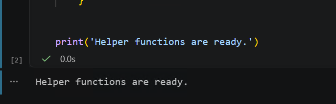

1. Run the main code cell (**Cell 3: Run Full Simulation with 6 Monthly Sessions**). This cell processes six simulated monthly conversations, extracts new long-term insights, updates the importance of previously referenced insights, and automatically applies bounded memory by retaining only the highest-priority insights.

   

1. As the simulation progresses, observe how the memory evolves after each session. The notebook displays the current memory state, extracts new insights, identifies previously referenced insights, and, once the total exceeds **`MAX_INSIGHTS = 5`**, ranks all insights by their retention score before pruning the lowest-priority ones. By the end of the simulation, notice that the memory contains only the five most valuable insights, demonstrating how bounded memory preserves important information while discarding less relevant insights.

   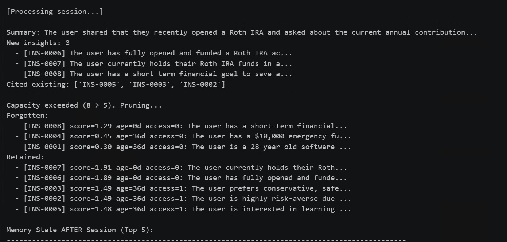

1. After the simulation completes, review the output and observe how the bounded memory system manages long-term insights. Notice that new insights are extracted after each session, previously referenced insights receive higher retention scores, and once the total exceeds **`MAX_INSIGHTS = 5`**, lower-priority insights are automatically pruned.

   

2. Verify that the final memory contains only the highest-priority insights. Compare the **Forgotten** and **Retained** sections, and notice that insights with higher **retention scores** and **access counts** are preserved, while older or less frequently referenced insights are removed to keep the memory within the configured limit.

   

## Task 4.3: Compare Synthesis Strategies

In this task, you will open the `06_insight_curation.ipynb` notebook (which you ran in Exercise 2), then place both notebooks side by side to compare the two strategies across four dimensions. No new concepts are introduced — the goal is to lock in a clear mental model you can use when designing real agent memory systems.

### What is the difference between the two strategies?

Read this summary so you know what to look for in the output:

| | `08_itemized_insights.ipynb` (this exercise) | `06_insight_curation.ipynb` (Exercise 2) |
|---|---|---|
| **What it does** | Holds a hard cap of 5 insights. When the cap is hit, the weakest insight is deleted | Synthesizes a free-form narrative profile after every session. No cap on size |
| **How contradictions are handled** | Older contradicted insights are likely to decay (low access count) and eventually get pruned | Contradictions are explicitly detected and resolved into an evolution narrative (*"User WAS conservative, NOW aggressive"*) |
| **Output style** | A scored, tabular list of short insight strings | A narrative profile that evolves and is actively rewritten |
| **Best fit** | Long-running agents where memory size must stay predictable | Agents where understanding *how* a user's situation changed over time is important |

1. In the Explorer pane, open the **06_insight_curation.ipynb** notebook   - Right-click the **06_insight_curation.ipynb (1)** tab at the top and select **Split Right (2)** along with `08_itemized_insights.ipynb`:

      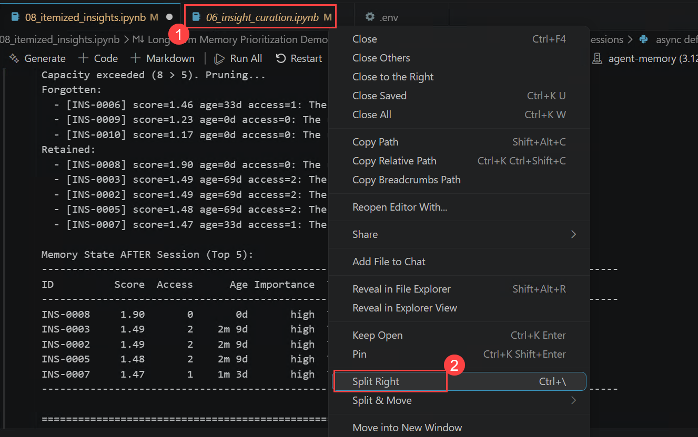

1. This places both notebooks side by side so you can compare their output directly.

      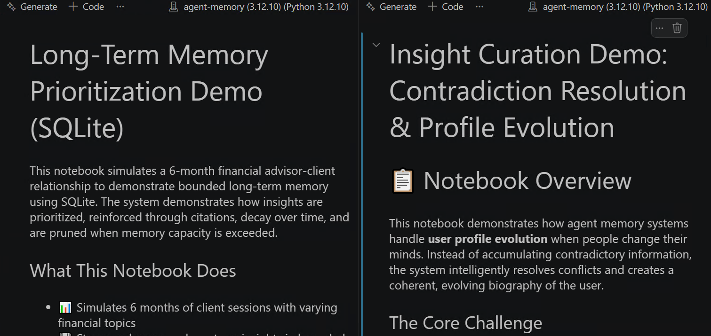.

1. Now compare the two notebooks side by side. Verify each row of the following table against the output you see in both panes:

   | Dimension | `08_itemized_insights.ipynb` | `06_insight_curation.ipynb` |
   |---|---|---|
   | **Scale** | Insight count stays at exactly 5 regardless of how many sessions run | Insights accumulate freely — count grows with every session |
   | **Contradiction handling** | Contradicted insights decay naturally if they stop being cited — they are not explicitly detected, just gradually pruned | Contradictions are explicitly detected and resolved into a single evolution narrative: *"WAS conservative → NOW aggressive"* |
   | **Human readability** | A clean, scored table of short facts — easy for a developer or operator to review at a glance | A narrative profile — richer context but harder to audit at scale |
   | **Production fit** | Best for long-running agents where memory size, cost, and latency must stay predictable | Best for agents where understanding *how* a user's situation changed matters (e.g., financial advisor, career coach) |

1. Confirm you can explain the difference between the two strategies in one sentence each:

   - **`08_itemized_insights`:** find the final session's `Memory State AFTER Session (Top 5)` table in the left pane — this is a bounded, scored list of the 5 most valuable facts the agent knows about Alex.
   - **`06_insight_curation`:** find the `evolution_insights` section in Cell 7's output in the right pane — this is a narrative that explicitly describes *how* Alex's profile changed over time, not just what it is now.

      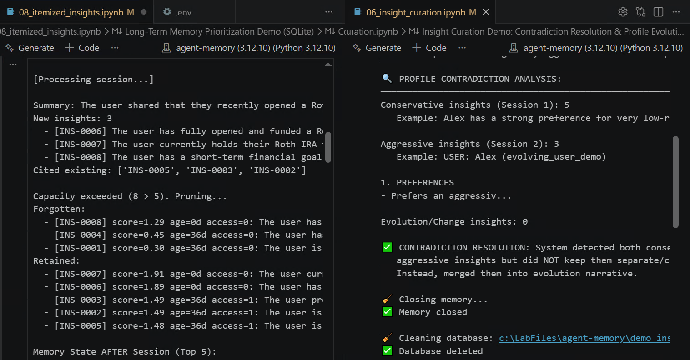.

## 🧾 Summary

In this exercise, you explored two complementary approaches to managing long-term agent memory. You first ran the **`08_itemized_insights.ipynb`** notebook to observe how bounded memory prioritizes insights using retention scores based on recency, frequency, and forgetting, ensuring that only the five highest-value insights are retained over time. You then compared this approach with the **`06_insight_curation.ipynb`** notebook, where contradictory insights are resolved into an evolving user profile rather than simply being removed. By comparing both notebooks, you learned when to use bounded memory for scalable, long-running agents and when insight curation is better suited for scenarios that require tracking and understanding how a user's preferences and behavior change over time.

You have successfully completed this exercise. Click **Next >>** to continue to the next exercise.

   