# Exercise 5: Live Server Mode & Streamlit UI

### Estimated Duration: 90 Minutes

## 📘 Scenario

Contoso AI Solutions wants to explore a **service-based memory architecture** where multiple applications can access and share the same centrally managed Agent Memory. In the previous exercises, the notebooks interacted directly with **AgentMemory**, meaning the application, memory engine, and database all ran within the same Python process. While this approach is ideal for learning how Agent Memory works, separating the memory service from client applications demonstrates how these components can communicate independently over HTTP.

In this exercise, you will work with a **FastAPI-based memory service** that runs independently of the client applications. You will start the memory server, connect both a terminal client and a Streamlit web application to it, and observe how multiple clients can share the same persistent memory. By interacting with the server from different clients, you will see how conversations, sessions, and long-term insights are centrally managed while each client simply communicates with the server through HTTP requests.

## 📖 Overview

In this exercise, you will deploy and interact with an **Agent Memory server** that exposes memory functionality through a **FastAPI** service. You will verify that the server is running correctly, connect to it using both a terminal client and a Streamlit web application, and observe how multiple clients access the same centralized memory service over HTTP. As you interact with the server, you will see conversations, sessions, and long-term insights being stored and shared across different clients, demonstrating how Agent Memory is deployed in a production-style architecture where a single memory service supports multiple applications.

## 🎯 Objectives

   - Task 1: Configure and Start the Memory Server  
   - Task 2: Run the Server Mode Terminal Demo 
   - Task 3: Launch the Streamlit Live UI 
   - Task 4: Verify cross-session recall
   - Task 5: Test Interactive Memory across Clients 

## Task 1: Configure and Start the Memory Server

In this task, you will start the server in its own terminal and verify it is healthy before connecting any clients.

### What is the FastAPI memory server?

In the previous exercises, the notebooks interacted directly with **AgentMemory**, using Python methods to start sessions, store conversation turns, retrieve memory context, and end sessions. In this exercise, those same memory operations are exposed through a **FastAPI** server as **HTTP endpoints**. Instead of calling Python functions directly, client applications send HTTP requests to the server to perform these operations. This allows multiple clients to share the same centralized memory service without needing to understand the underlying memory implementation they simply communicate with the server using its URL.


1. Click on the **ellipsis (...) (1)** in the top menu, then select **Terminal (2)** and click **New Terminal (3)**.

   

1. Paste the below command in the terminal to start the FastAPI memory server:

   ```
   uv run uvicorn server.main:app --host 127.0.0.1 --port 8000
   ```
   
   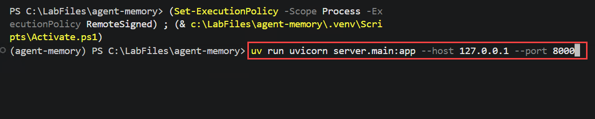

   > **What this means:** `server.main:app` tells Uvicorn to open `server/main.py` and find the `app` variable the FastAPI application object. `--host 127.0.0.1` restricts it to your local machine. `--port 8000` is the port both clients will use.

1. Watch for the startup confirmation as shown in the following image.

   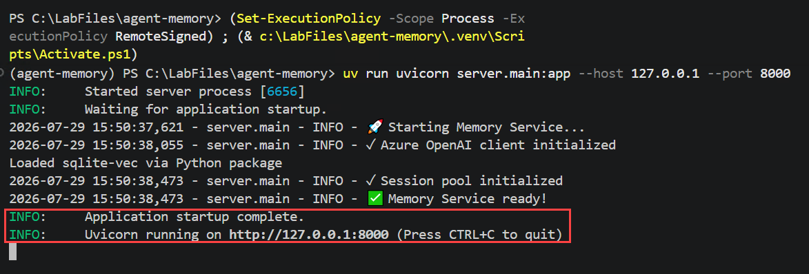

   > **Note: Do NOT close Terminal 1 or press Ctrl+C during this exercise.** Both clients fail immediately if the server stops.

1. Click the **+** icon to open a **second terminal**. This is **Terminal 2 - your client terminal**.

   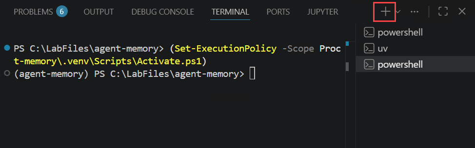

1. Execute the below command to verify the server health and Confirm the response **healthy**.

   ```
   Invoke-RestMethod http://127.0.0.1:8000/health
   ```
   
   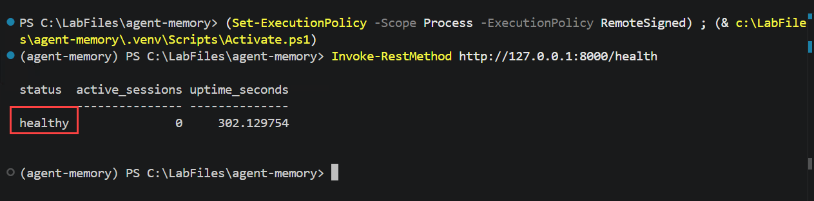

## Task 2: Run the Server Mode Terminal Demo 

In this task, you will run the scripted demo a fixed 5-turn automatic conversation and observe the complete memory lifecycle: session start → turns stored → session end → insights extracted.

1. In **Terminal 2**, run the following command to execute the `05_server_mode.py` in scripted mode. Once the command executes successfully, verify from the output that the **Memory service is healthy** and a **session has started**, as shown in the image below.

   ```
   uv run python demo/05_server_mode.py --scripted
   ```
   
   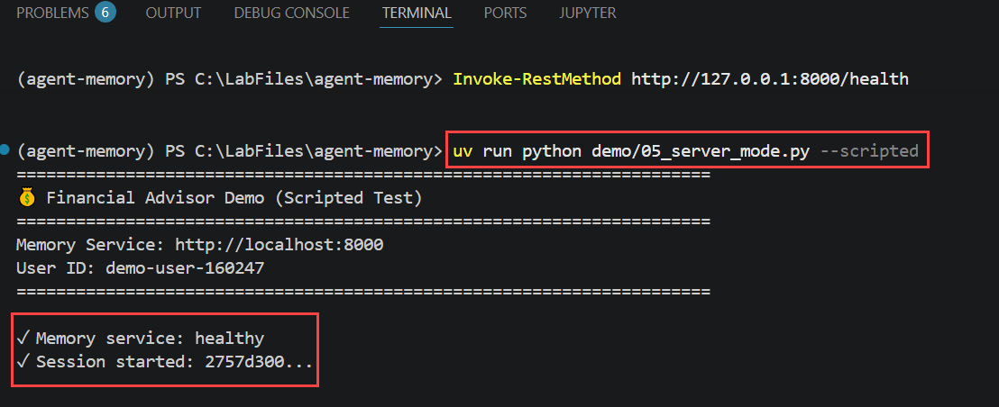

1. Watch each turn as it stores. After all 5 turns, the script attempts a semantic search. You may see the below result

   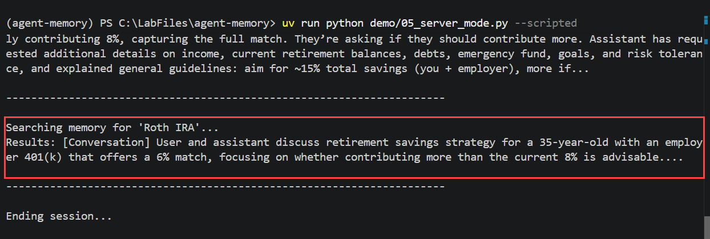

   > **Note:** If you see `ReadTimeout` error This is a known timeout issue. The semantic search generates an embedding via Azure OpenAI before searching, which can exceed the HTTP client's default timeout under lab conditions. **Your session data is completely intact** all 5 turns were stored before this step ran. The search concept is demonstrated visually in Task 3 through the Key Insights panel. To retry with a longer timeout:
   > ```
   > $env:HTTPX_TIMEOUT=60; uv run python demo/05_server_mode.py --scripted
   > ```

1. Review the **session summary** at the end of the demo. Verify that the server processed the completed conversation, extracted long-term insights using the reflection engine, and stored them in the database so they can be automatically loaded in future sessions for the same **`user_id`**.

   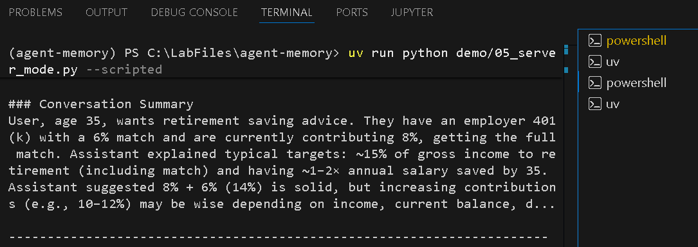

1. Switch to **Terminal 1** (the server terminal) and scroll the log. Confirm the below shown logs

   ```
   INFO: POST /sessions/start - 200
   INFO: POST /sessions/turn - 200 
   INFO: GET  /memory/context - 200
   INFO: POST /sessions/end - 200
   ```

   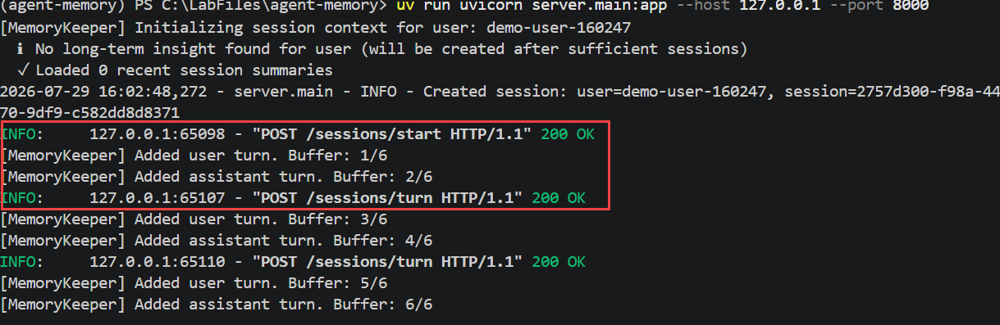

   > **Note:** Every operation was an HTTP request. `05_server_mode.py` is just an HTTP client. All memory logic ran inside `server/main.py`.

## Task 3: Launch the Streamlit Live UI

In this task, you will open the Streamlit browser UI and use its playback controls to replay a scripted scenario while watching the Memory System State panel update live.

### What the Streamlit UI is

The Streamlit UI is a **memory visualization dashboard** it makes the internal state of the memory system visible as a scenario plays. It is not a live chat box. As turns process:

- **Turns Processed** - live counter of turns stored in this session.
- **Context Length** - character count of the memory context. Grows with each turn.
- **Insights** - count of long-term insights. Stays at 0 during the session, jumps at session end.
- **Current Context** - shows the memory currently available to the agent.
- **Session Summary** - shows a summary of the completed conversation.
- **Extracted Insights** - shows important facts and preferences learned from the conversation.

1. Click **+** to open a **third terminal**. This is **Terminal 3 - the Streamlit terminal** and execute the below command to start the Streamlit UI.

   ```
   uv run streamlit run demo/07_interactive_ui.py
   ```

   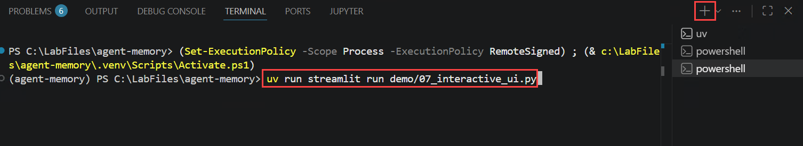

1. If it is prompted to provide the Email, keep it blank and press **Enter** in your keyboard

   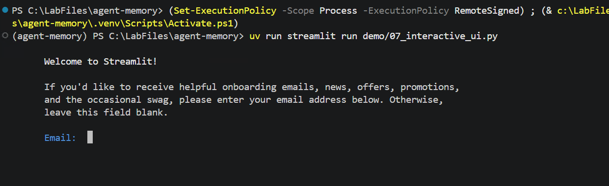

1. When Streamlit prints the URL, it will automatically opens in the browser. If it is not opened automatically, paste the below url in the browser to get the Streamlit UI

   ```
   http://localhost:8501
   ```

   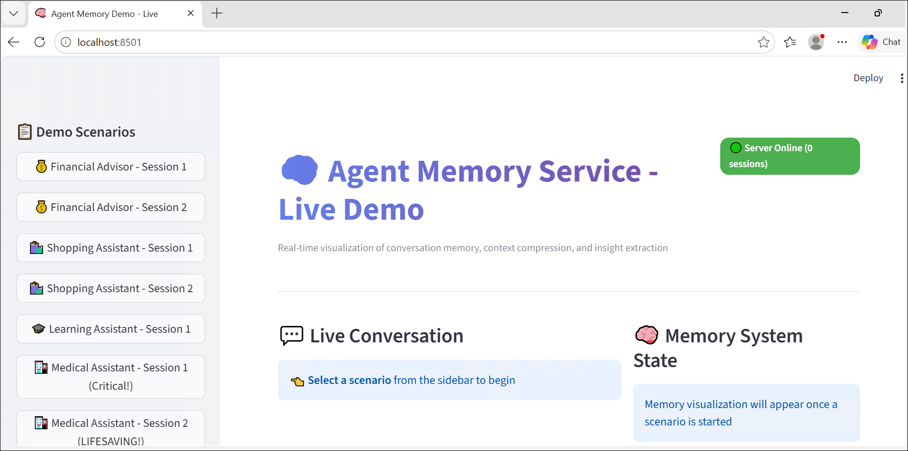

1. Confirm the **🟢 Server Online** indicator in the top-right corner.

   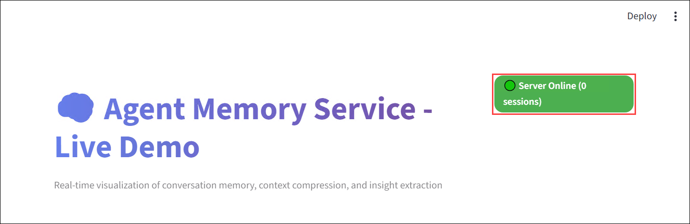

   > **Note:** If you see 🔴 Server Offline, return to Terminal 1 and confirm the server is still running. Restart if needed.

1. Click **💰 Financial Advisor - Session 1** in the left sidebar.

   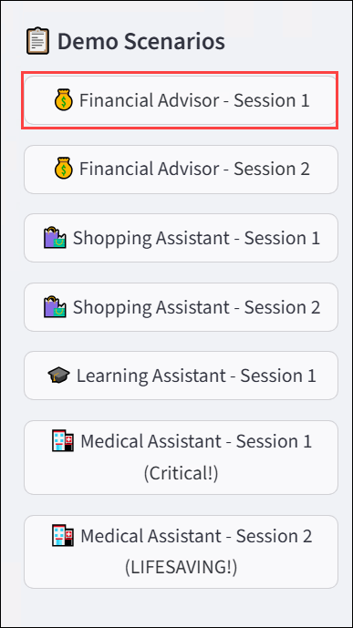

1. At the bottom of the left sidebar, find **Playback Controls**. Use these options:

   - **⏭ Next (1)** - advances one turn at a time. Use this to read each turn carefully.
   - **▶ Play (2)** - runs all turns automatically at a set pace.

      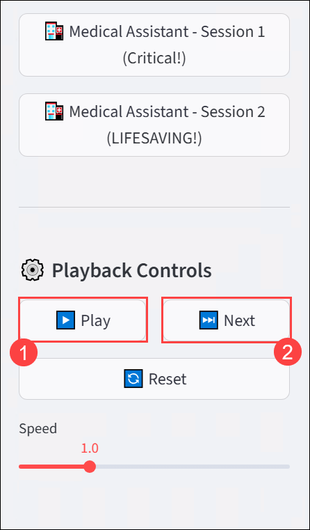

1. Click **⏭ Next** three times and observe how the **Memory System State** updates after each step. Notice that the **Turns Processed** counter increases as each conversation turn is stored, the **Context Length** grows as more conversation is added to memory, and the **Live Conversation** panel displays the user and advisor messages as they are processed.

   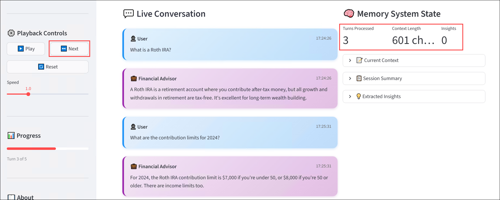

1. Click **▶ Play** to run the remaining turns. Watch **Turns Processed** count to 5 and **Context Length** grow.

1. When playback completes, watch the **Insights counter** jump from 0 to a positive number (3–5). you will get summary and insights. This is `end_session(trigger_reflection=True)` running durable facts extracted, written to the database.

   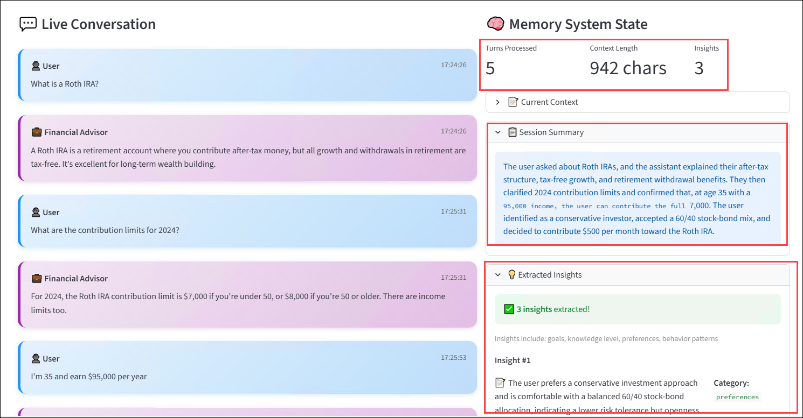

## Task 4: Verify cross-session recall 

In this task, you will verify that Agent Memory persists across multiple sessions by observing how Session 2 automatically retrieves and uses information stored during Session 1 before processing any new conversation.

1. Click **💰 Financial Advisor - Session 2** in the left sidebar.

   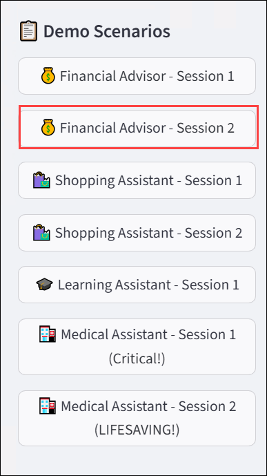

1. Before clicking **▶ Play**, verify that **Turns Processed** is **0**, while the **Context Length** is already greater than **0** and the **Current Context** displays Sarah's profile from the previous session. This confirms that the server automatically loaded the stored memory at the start of Session 2, before any new conversation turns were processed.

   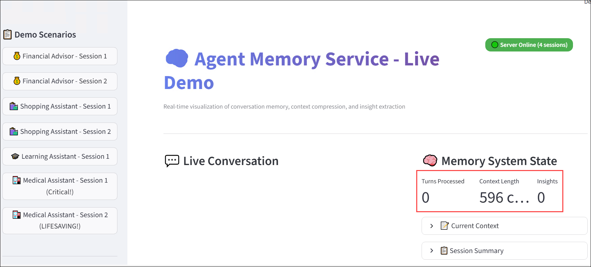

1. Click **▶ Play (1)** and watch the Session 2 conversation. The first user message should reference prior context **(2)**

   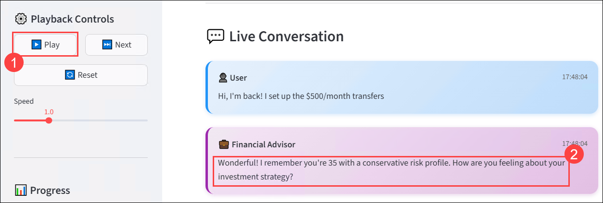

1. After Session 2 finishes, compare the **Insights counter** to the count from Session 1 it should be higher, as new insights accumulated or existing ones were updated.

   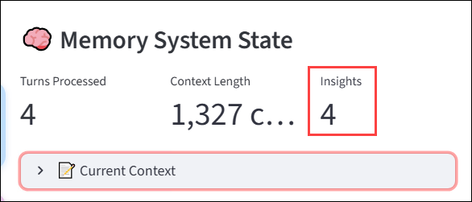

1. Scroll down and expand **Current context** to see **Recent Session Summaries**. Confirm at least one entries with timestamps.

   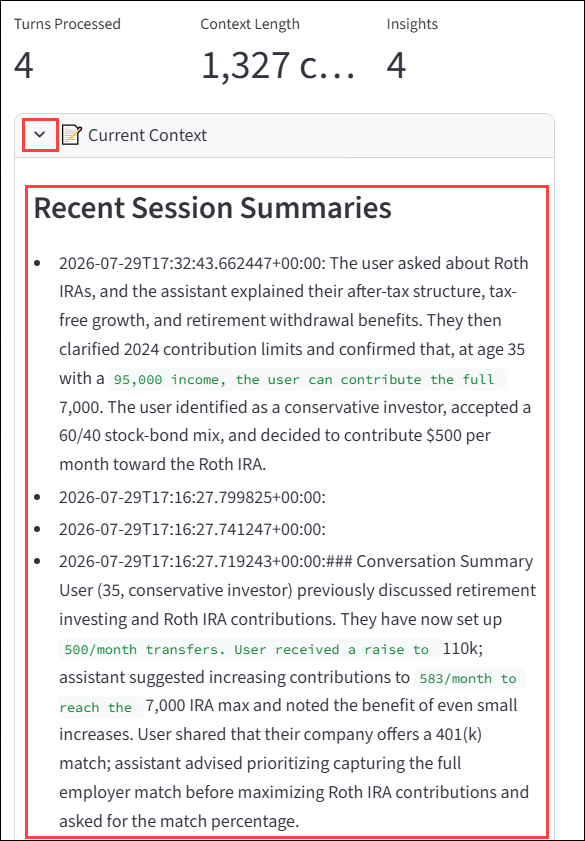

   > **Note:** Every future session will load these summaries in its context giving the agent a compressed relationship history, not just the most recent turns.


## Task 5: Test Interactive Memory Across Clients

This is the exercise's hands-on capstone. You will run the terminal client in **interactive mode**, type your own messages as a new user, end the session, and then verify in the Streamlit browser that those exact messages were stored by the server. This closes the full loop: your input → server → database → browser.

1. Go to **Visual Studio** and select **Terminal 2 (1)**, then run the below command **(2)** to start the interactive client:

   ```
   uv run python demo/05_server_mode.py
   ```

   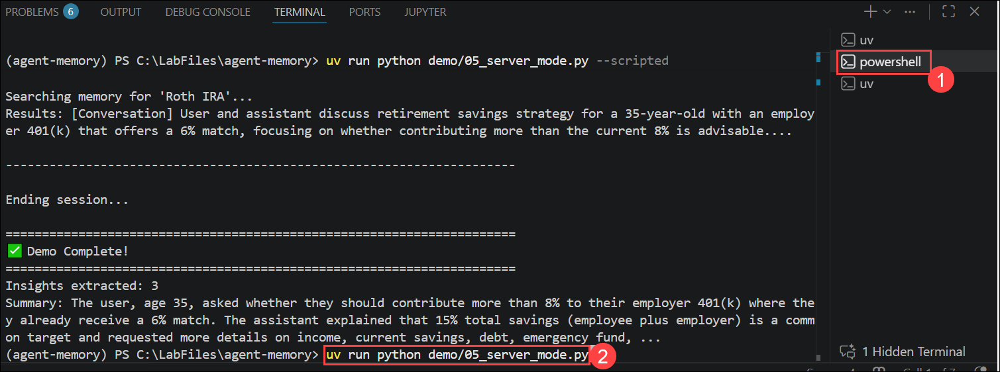

1. Wait for the chat prompt. The output will look like below. Write down your `User ID` for later use

   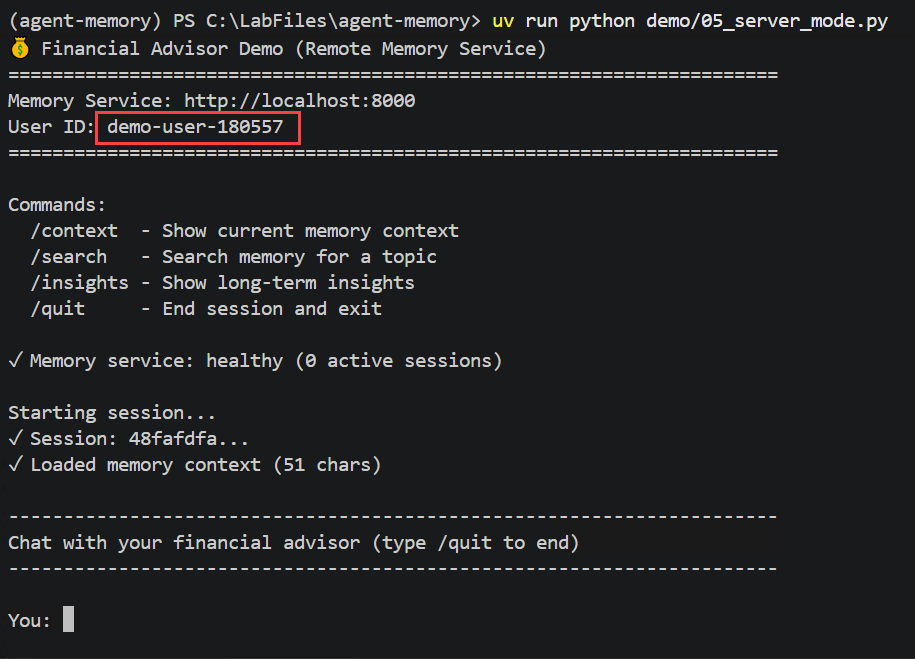

1. Type and send the following four prompts. Press Enter after each, wait for the advisor to respond, then type the next:

   **Prompt 1:**
   ```
   My name is Alex and I am a 28-year-old software engineer earning 90000 dollars a year.
   ```
   *Wait for the advisor's response it may ask follow-up questions. Ignore them and type Prompt 2.*

   **Prompt 2:**
   ```
   I want to invest aggressively. I am comfortable with 100 percent stocks and high volatility.
   ```
   *Wait for the response, then type Prompt 3.*

   **Prompt 3:**
   ```
   I have no debt and I can invest 800 dollars every month.
   ```
   *Wait for the response, then type Prompt 4.*

   **Prompt 4:**
   ```
   Based on what you know about me, what is the single most important first step I should take?
   ```

   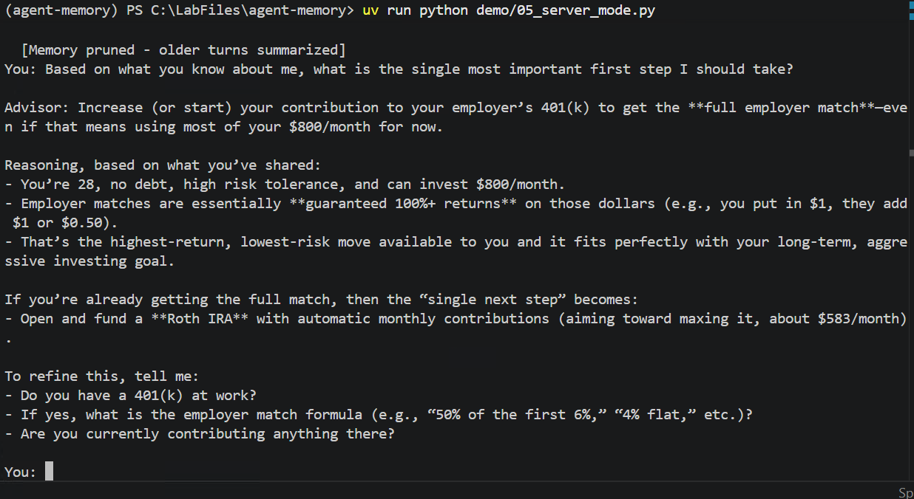

1. After the advisor responds to Prompt 4, end the session by executing below command:

   ```
   /quit
   ```

1. Read the session end output and confirm the summary accurately reflects your four prompts 

   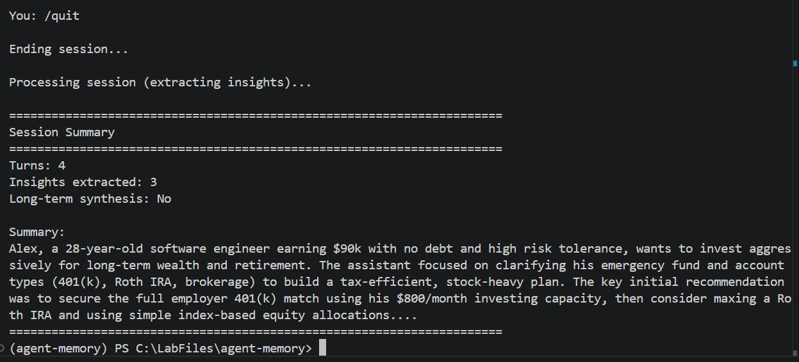

   > **Note:** If the session end times out or crashes, your 4 turns were stored before the timeout. The summary may not print, but your data is in the database. Continue to Step 6.

1. Now, open `demo/05_server_mode.py` **(1)** in VS Code. Find this below line at the 41 line **(2)**:

   ```
   USER_ID = f"demo-user-{datetime.now().strftime('%H%M%S')}"
   ```
   
   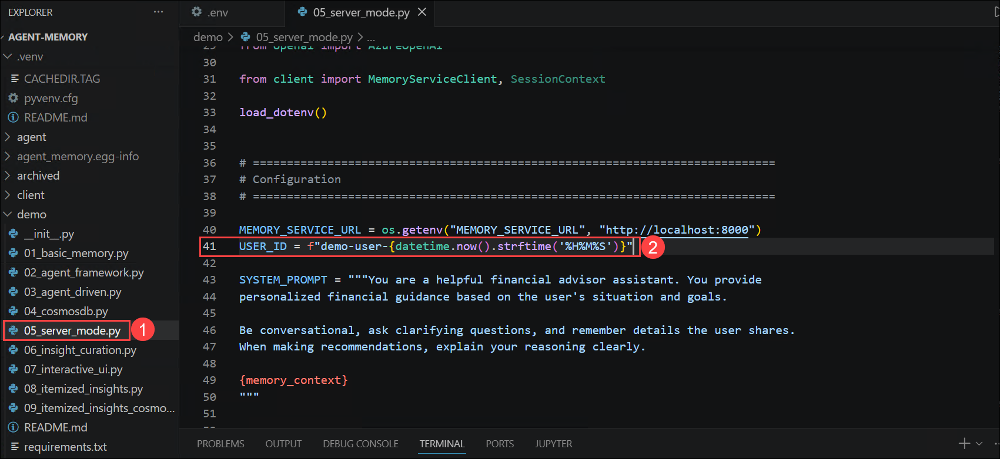

1. Temporarily change it to your specific ID from Step 2 and save the file by clicking on **Ctrl + S**:

   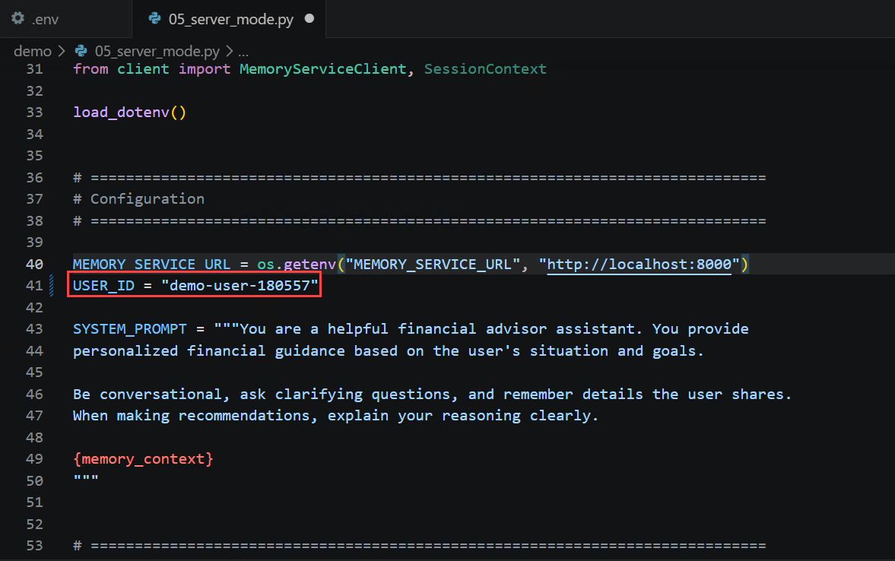

1. Run the demo again using below command:

   ```
   uv run python demo/05_server_mode.py
   ```

   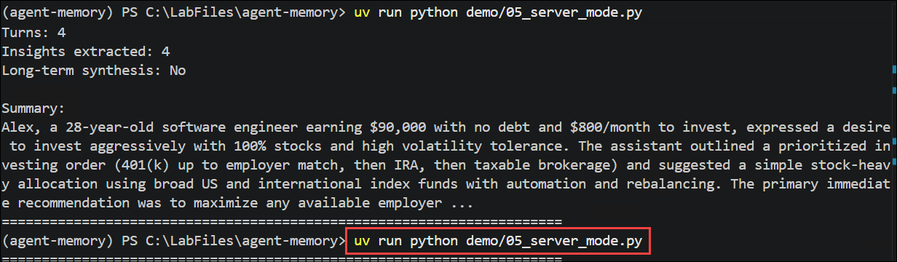

1. At session start, you can see that it is loaded the memory context from the previous session:

   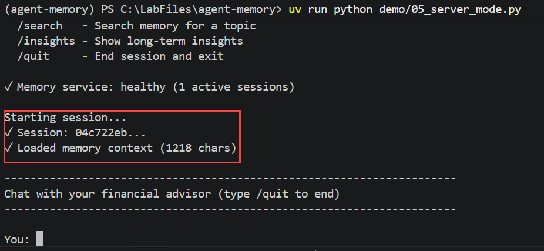

1. Ask the Advisor below question and it will give all the points that was provided in the previous session.

   ```
   What do you know about me
   ```

   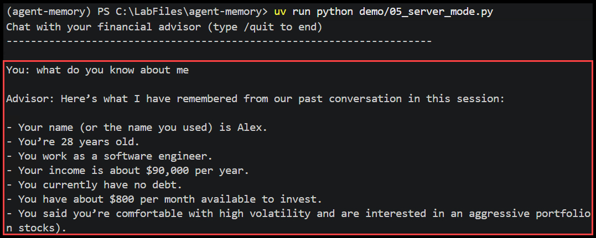

1. once it is verified you can use below command to exit from the session

   ```
   /quit
   ```

   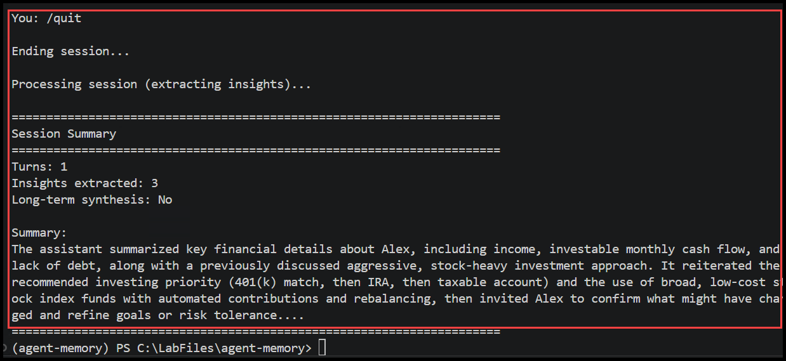

1. After verifying, restore the original `USER_ID` line with below command:

   ```
   USER_ID = f"demo-user-{datetime.now().strftime('%H%M%S')}"
   ```

   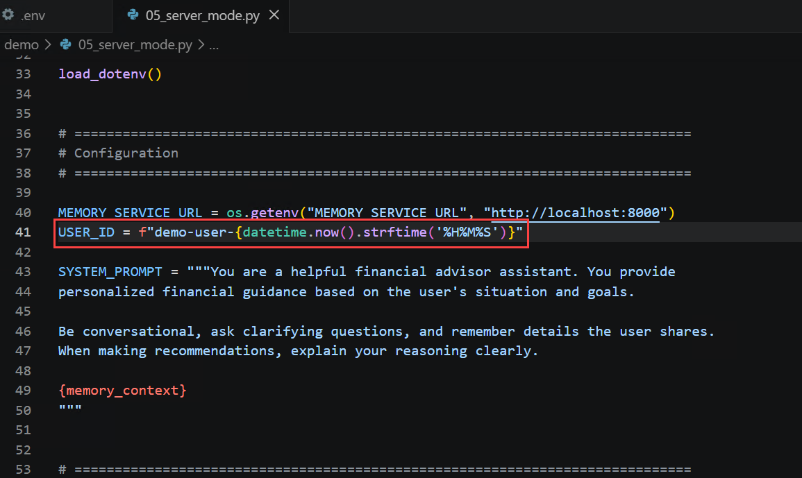

1. Then, go to **Terminal 1 & 3** and stop the server and streamlit UI by clicking on **CTRL + C**.

1. Confirm the final architectural truth of this exercise by reading the following and verifying each point against what you observed:

   | What you did | What it proves |
   |---|---|
   | Typed prompts in terminal → saw `→ Stored (turn N)` | The terminal client sent HTTP to the server; no direct DB access |
   | `/quit` triggered insight extraction | `end_session()` runs on the server, not in the client |
   | Scripted demo started with larger context length after using your User ID | Your data survived as a separate client process started and connected |
   | Streamlit showed 🟢 Server Online throughout | Both clients share one server; neither has its own memory |

   **One server. Multiple clients. Shared memory. This is the architecture.**

> **Congratulations** on completing the task! Now, it's time to validate it. Here are the steps:
> - Hit the Inline Validate button for the corresponding task. If you receive a success message, you can proceed to the next task.
> - If not, carefully read the error message and retry the step, following the instructions in the lab guide.
> - If you need any assistance, please contact us at cloudlabs-support@spektrasystems.com. We are available 24/7 to help.
 
<validation step="987a16da-e353-4a0e-9434-35ba4a131cb0" />

## 🧾 Summary

In this exercise, you deployed and interacted with Agent Memory as a standalone **FastAPI** service, demonstrating a production-style architecture where multiple clients communicate with a centralized memory server over HTTP. You verified the server health, ran the scripted terminal demo, observed conversation turns being stored, sessions being completed, and long-term insights being extracted, while confirming that all memory operations were performed through the server rather than direct database access.

You then explored the Streamlit visualization dashboard to observe memory being built in real time, verified cross-session memory recall by confirming previously stored context was automatically loaded before a new session began, and completed an interactive conversation using the terminal client. Finally, you confirmed that conversations and insights persisted across different client applications, demonstrating how a single memory service can provide shared, persistent memory for multiple independent clients.

You have successfully completed this exercise. Click **Next >>** to continue to the next exercise.

   
